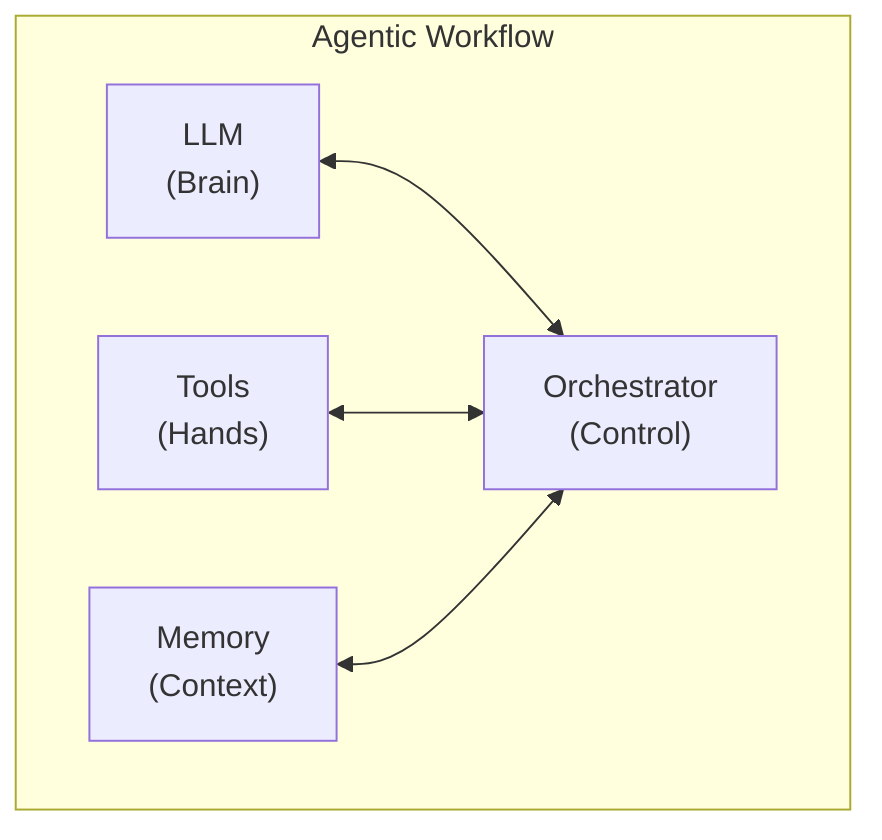
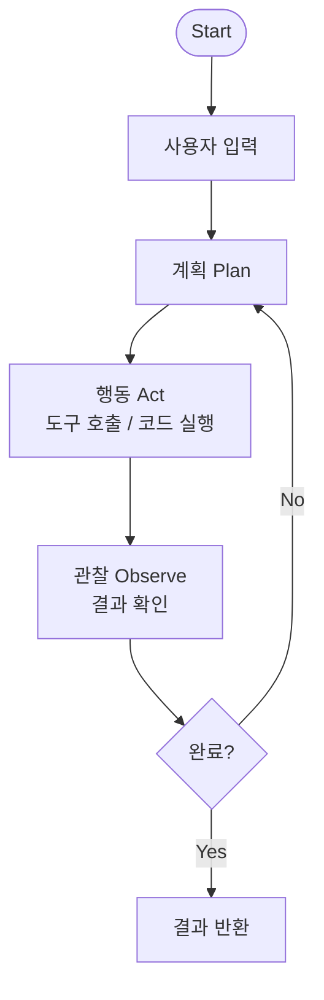
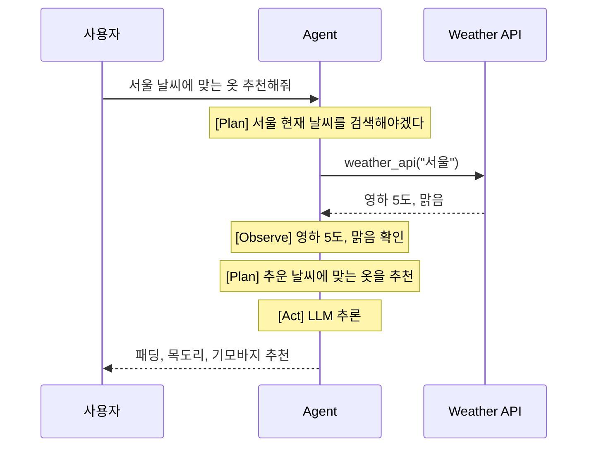
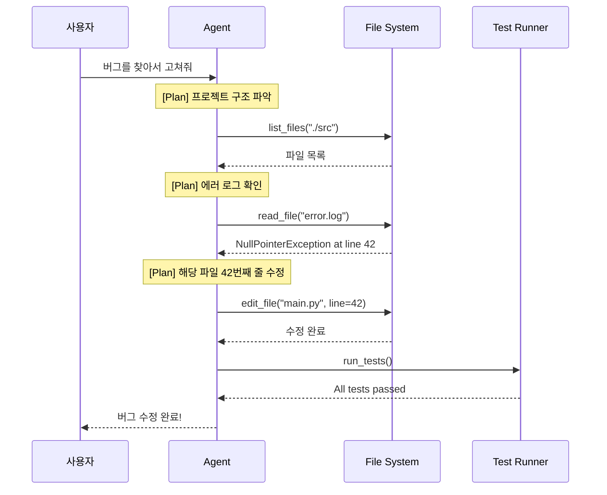

# 001. Agentic Workflow 개요

---

## Agentic Workflow란?

> LLM이 **자율적으로 판단하고, 도구를 사용하며, 반복적으로 문제를 해결**하는 워크플로우

### 기존 LLM 사용 방식 vs Agentic Workflow

| 구분      | 기존 방식 (Single-turn) | Agentic Workflow                 |
| --------- | ----------------------- | -------------------------------- |
| 흐름      | 질문 → 답변 (1회)       | 질문 → 계획 → 실행 → 관찰 → 반복 |
| 도구 사용 | 없음                    | 외부 도구/API 호출               |
| 자율성    | 수동적 응답             | 능동적 판단과 행동               |
| 복잡도    | 단순 질의응답           | 다단계 복합 작업                 |
| 결과물    | 텍스트 응답             | 실제 작업 수행 결과              |

---

## 왜 Agentic Workflow인가?

### LLM의 한계

- **지식의 한계**: 학습 데이터 이후의 정보 부재
- **실행 능력 부재**: 텍스트 생성만 가능, 실제 행동 불가
- **단일 턴의 제약**: 복잡한 문제를 한 번에 해결하기 어려움
- **환각(Hallucination)**: 사실이 아닌 정보를 생성

### Agentic Workflow의 해결

- **도구 사용**: 검색, 코드 실행, API 호출로 한계 극복
- **반복적 개선**: 결과를 관찰하고 개선하는 루프
- **자기 검증**: 스스로 결과를 검증하고 수정
- **작업 분해**: 복잡한 문제를 단계별로 나누어 해결

---

## Agentic Workflow의 핵심 구성 요소

### 1. LLM (Brain) - 두뇌

- 자연어 이해 및 추론
- 계획 수립 및 의사결정
- 결과 해석 및 판단

### 2. Tools (Hands) - 도구

- 웹 검색, 코드 실행, 파일 조작
- 외부 API 호출 (DB, 서비스 등)
- 사용자 환경과의 인터랙션

### 3. Memory (Context) - 기억

- **단기 기억**: 현재 대화 컨텍스트
- **장기 기억**: 과거 대화/작업 이력, 벡터 DB
- **작업 기억**: 현재 작업의 중간 상태

### 4. Orchestrator (Control) - 제어

- 전체 흐름 관리 (루프, 분기, 종료 조건)
- 에러 핸들링 및 재시도
- 도구 호출 스케줄링

---

## Agentic Workflow의 기본 루프

---

## 실세계 예시

### 예시 1: "서울 날씨에 맞는 옷을 추천해줘"

### 예시 2: "이 프로젝트의 버그를 찾아서 고쳐줘"

---

## Andrew Ng의 Agentic Workflow 강조점

> *"AI agentic workflows will drive massive AI progress this year"*
> — Andrew Ng, 2024

### 핵심 메시지

1. **Zero-shot vs Agentic**: GPT-3.5를 Agentic으로 쓰면 GPT-4 Zero-shot보다 성능이 좋을 수 있다
2. **반복(Iteration)이 핵심**: 한 번에 완벽한 답을 기대하지 말고, 반복적으로 개선
3. **사람의 작업 방식과 유사**: 초안 → 검토 → 수정 → 완성

---

## 정리

| 핵심 개념     | 설명                           |
| ------------- | ------------------------------ |
| **자율성**    | LLM이 스스로 판단하고 행동     |
| **도구 사용** | 외부 도구로 LLM의 한계 극복    |
| **반복 루프** | Plan → Act → Observe 순환      |
| **복합 작업** | 단순 Q&A를 넘어 실제 작업 수행 |

**다음 장**: Agentic Design Patterns →
