# 002. Agentic Design Patterns

---

## 4가지 핵심 Agentic Design Patterns

Andrew Ng이 제안한 4가지 핵심 패턴:

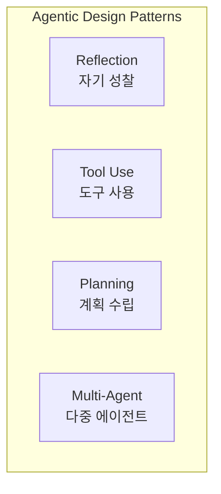

---

## Pattern 1: Reflection (자기 성찰)

> LLM이 자신의 출력을 **스스로 평가하고 개선**하는 패턴

### 구조

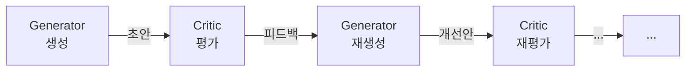

### 동작 방식

1. **생성(Generate)**: 초기 답변/코드 생성
2. **평가(Critique)**: 결과물을 비판적으로 검토
3. **개선(Refine)**: 피드백을 반영하여 개선
4. **반복**: 품질 기준 충족 시까지 반복

### 예시: 코드 리뷰 에이전트

```python
# Pseudo-code
def reflection_loop(task):
    code = llm.generate(task)           # 1. 코드 생성

    for i in range(max_iterations):
        review = llm.critique(code)      # 2. 자체 리뷰

        if review.is_satisfactory:       # 3. 품질 확인
            return code

        code = llm.refine(code, review)  # 4. 개선

    return code
```

### Reflection의 변형

| 변형            | 설명                      | 예시                     |
| --------------- | ------------------------- | ------------------------ |
| **Self-Refine** | 단일 LLM이 생성+평가      | 코드 생성 후 자체 리뷰   |
| **Reflexion**   | 실행 결과를 관찰하여 반영 | 테스트 실패 시 코드 수정 |
| **CRITIC**      | 도구로 검증 후 개선       | 계산기로 수학 답 검증    |

---

## Pattern 2: Tool Use (도구 사용)

> LLM이 **외부 도구를 호출하여 능력을 확장**하는 패턴

### 구조

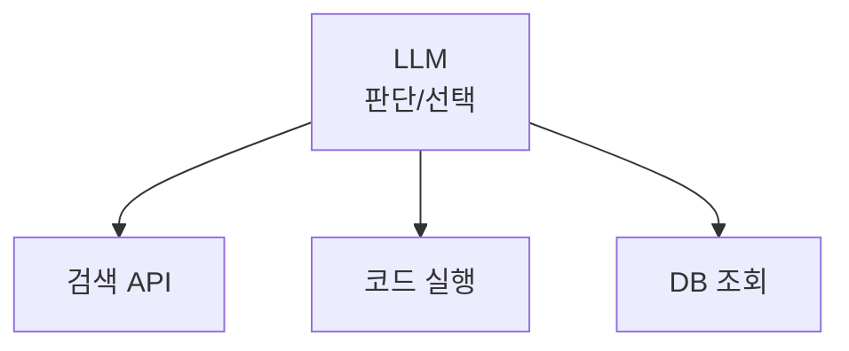

### 주요 도구 유형

| 도구 유형        | 예시                 | 역할              |
| ---------------- | -------------------- | ----------------- |
| **정보 검색**    | Web Search, RAG      | 최신 정보 획득    |
| **코드 실행**    | Python REPL, Sandbox | 계산, 데이터 처리 |
| **파일 조작**    | Read/Write/Edit      | 파일 생성 및 수정 |
| **외부 API**     | REST API, GraphQL    | 서비스 연동       |
| **데이터베이스** | SQL, Vector DB       | 데이터 조회/저장  |

### Function Calling의 흐름

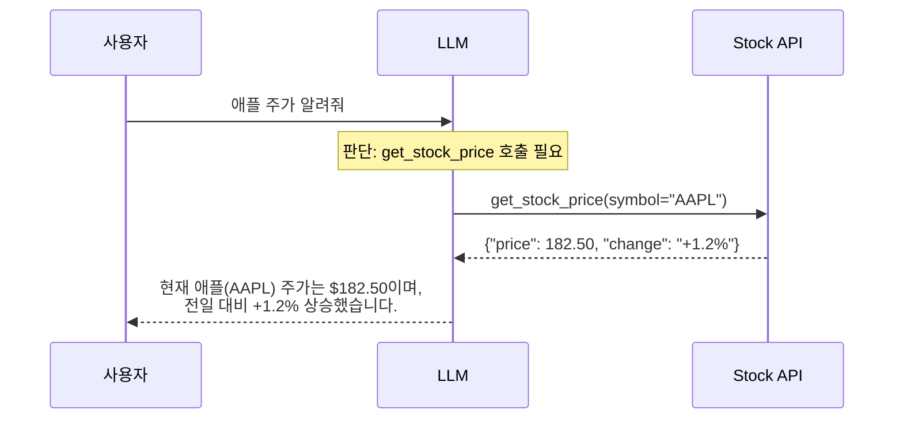

### MCP (Model Context Protocol)

- Anthropic이 제안한 도구 연결 표준 프로토콜
- 다양한 도구를 **통일된 인터페이스**로 LLM에 연결
- 이전 스터디(Advanced-01)에서 학습한 내용 참고

---

## Pattern 3: Planning (계획 수립)

> LLM이 복잡한 작업을 **단계별로 분해하고 순서를 정하는** 패턴

### 구조

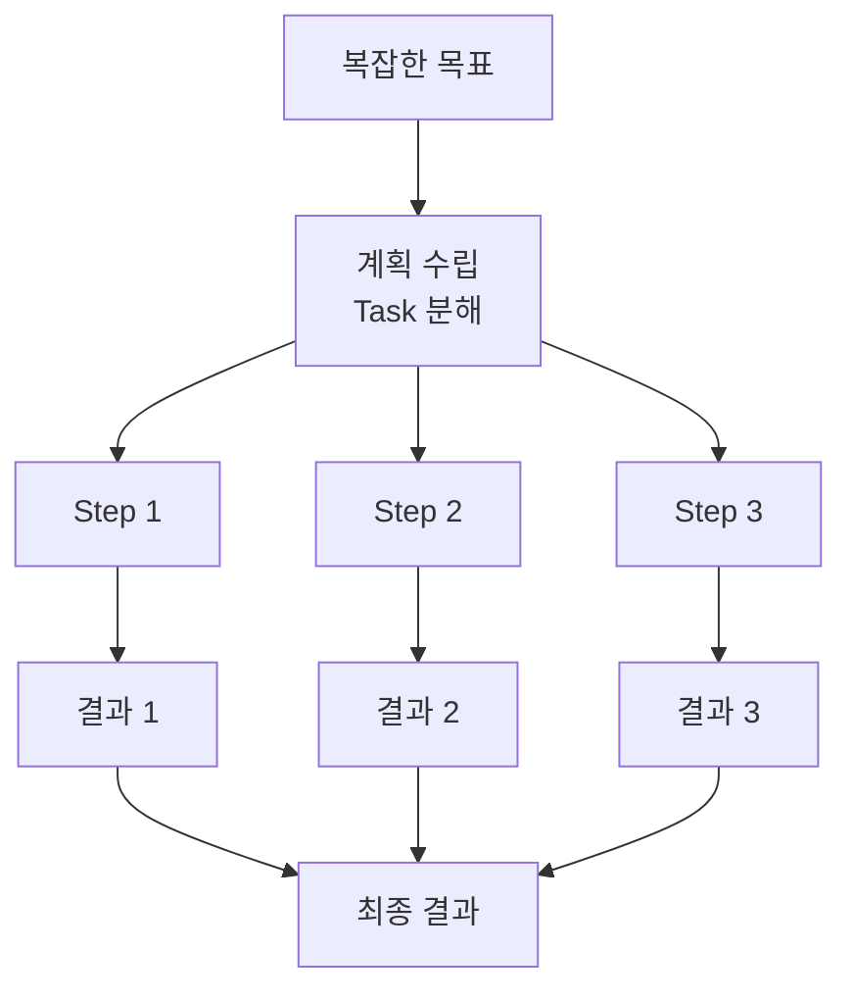

### 계획 수립 전략

#### 1. Sequential Planning (순차 계획)

```
Goal: "웹 애플리케이션 만들기"

Plan:
  1. 요구사항 분석
  2. DB 스키마 설계
  3. 백엔드 API 구현
  4. 프론트엔드 구현
  5. 테스트
  6. 배포
```

#### 2. Adaptive Planning (적응형 계획)

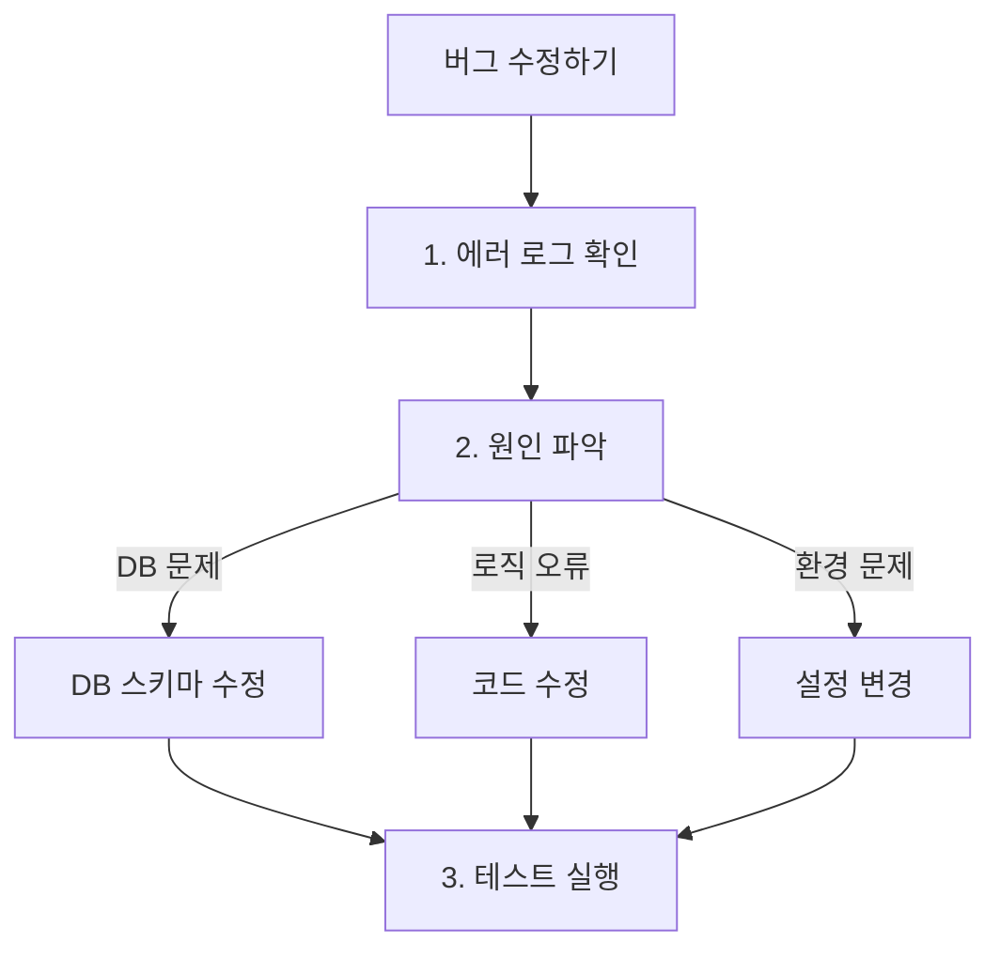

#### 3. ReAct (Reasoning + Acting)

가장 대표적인 Agentic 패턴:

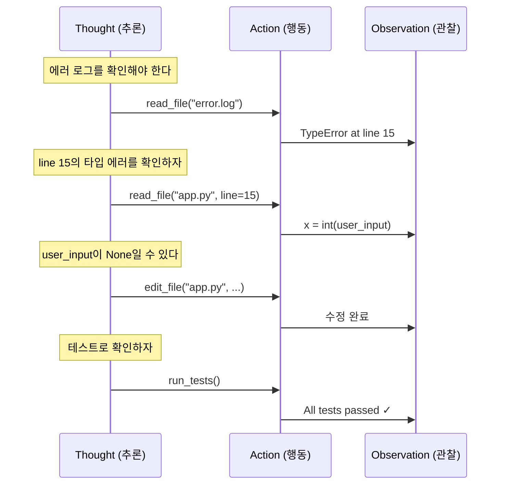

---

## Pattern 4: Multi-Agent (다중 에이전트)

> 여러 에이전트가 **역할을 나누어 협업**하는 패턴

### 구조 유형

#### A. 수평적 협업 (Peer Collaboration)

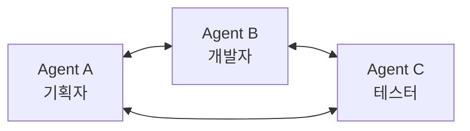

#### B. 계층적 관리 (Hierarchical)

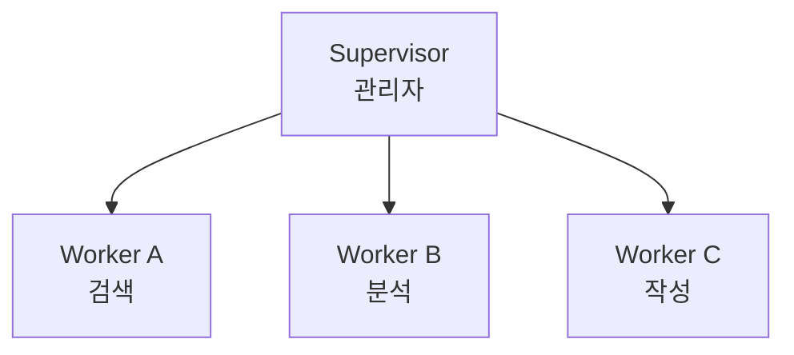

#### C. 파이프라인 (Sequential Pipeline)

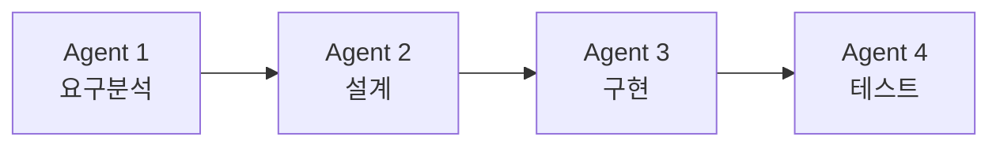

### Multi-Agent 예시: 소프트웨어 개발팀

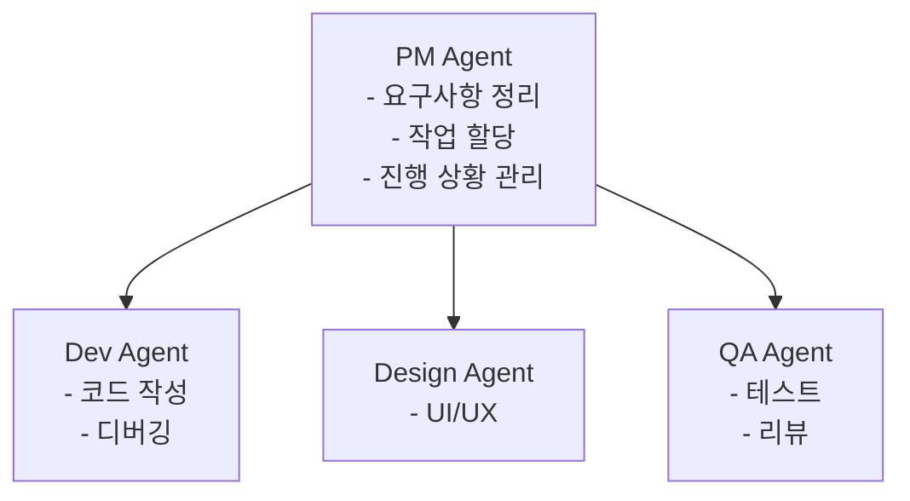

### 대표 프레임워크

| 프레임워크              | 특징                   |
| ----------------------- | ---------------------- |
| **AutoGen** (Microsoft) | 대화 기반 멀티에이전트 |
| **CrewAI**              | 역할 기반 에이전트 팀  |
| **LangGraph**           | 그래프 기반 워크플로우 |
| **OpenAI Swarm**        | 경량 멀티에이전트      |

---

## 패턴 조합

실제 프로젝트에서는 이 패턴들을 **조합**하여 사용:

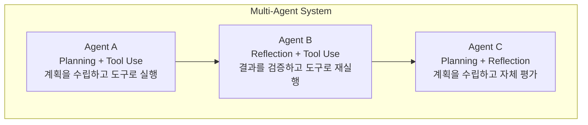

---

## 실사례: Genspark AI - 4가지 패턴의 조합

> Genspark은 2025년 AI 검색 엔진에서 **Agentic AI Workspace**로 전환,
> 4가지 패턴을 모두 조합하여 **L4 자율 에이전트**를 구현한 대표 사례

### Genspark의 아키텍처

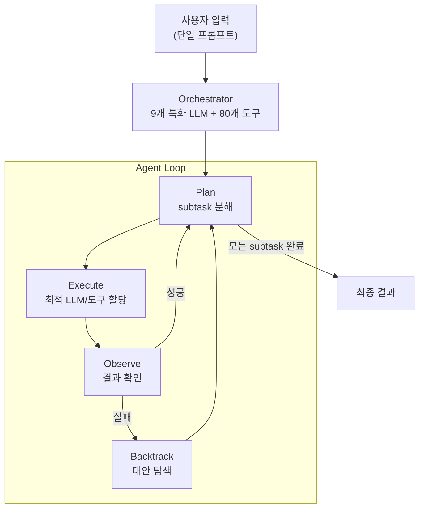

### 4가지 패턴이 어떻게 적용되는가?

| 패턴 | Genspark 적용 방식 |
|------|-------------------|
| **Planning** | 사용자 입력을 자동으로 subtask로 분해 |
| **Tool Use** | 80개 이상 도구 통합 (전화, 슬라이드, 영상, 검색 등) |
| **Routing** (Multi-Agent) | 9개의 특화 LLM 중 작업에 최적인 모델로 자동 라우팅 |
| **Reflection** | **Backtrack 단계** - 실패 시 대안 접근법을 탐색하여 재시도 |

### 핵심 철학: "Less Control, More Tools"

```
기존 방식:     사전 정의된 워크플로우 (rigid)
               → 엣지 케이스에서 깨짐

Genspark 방식: 사전 정의 없이 Agent가 자율적으로 경로 결정
               → 실패해도 Backtrack으로 복구
```

> *"Workflow in our definition is the predefined steps and these kinds of steps often break on edge cases."*
> — Kay Zhu, Genspark CTO

> *"Power actually lives in the backtrack stage."*
> — 실패 시 지능적으로 복구하고 대안을 찾는 것이 핵심

### Genspark이 할 수 있는 것

- 실제 **전화 걸기** (예약, 문의 - AI 음성)
- **슬라이드/영상** 자율 생성 (스크립트 → 이미지 → 편집)
- **Deep Research** (다중 모델로 정보 수집 → 분석 → 보고서)
- **Vibe Working** - 개발자의 Vibe Coding을 모든 직군으로 확장

### 성과

- 출시 45일 만에 ARR $36M 달성
- Series B $275M 투자 유치 (기업가치 $1.25B)

---

## 정리

| 패턴            | 핵심 아이디어      | 효과        |
| --------------- | ------------------ | ----------- |
| **Reflection**  | 자기 평가와 개선   | 품질 향상   |
| **Tool Use**    | 외부 도구 활용     | 능력 확장   |
| **Planning**    | 작업 분해와 순서화 | 복잡도 관리 |
| **Multi-Agent** | 역할 분담과 협업   | 확장성      |

> 실사례 Genspark은 이 4가지 패턴을 **모두 조합**하여 L4 자율 에이전트를 구현

**다음 장**: Agent 아키텍처 심화 →
