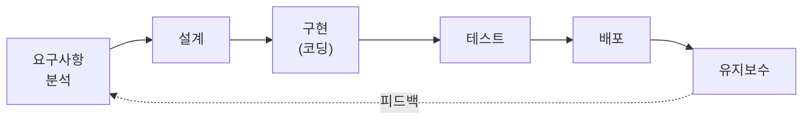
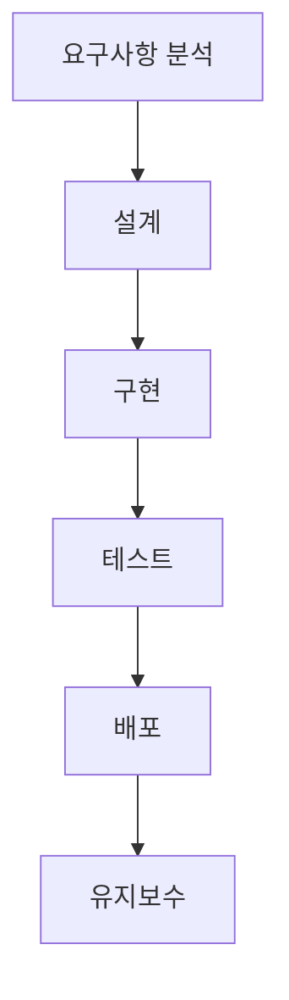
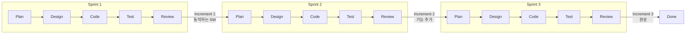
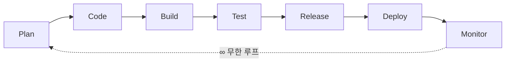
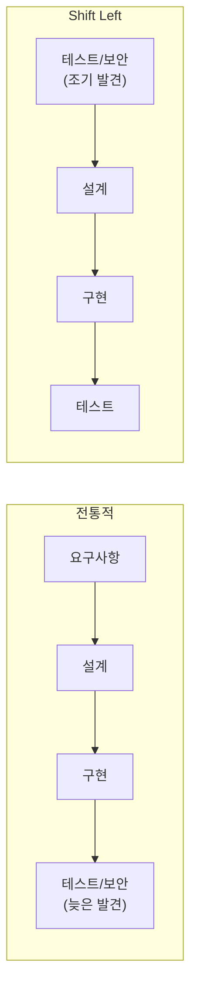
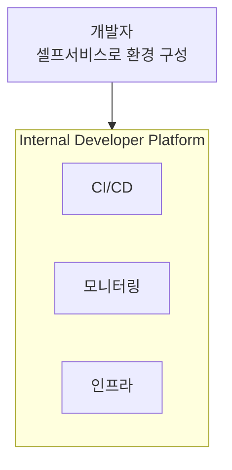

# 004. SDLC 개요와 전통적 모델

---

## SDLC란?

> **SDLC (Software Development Life Cycle)**
> 소프트웨어를 계획, 개발, 테스트, 배포, 유지보수하는 **전체 생명주기 프로세스**

### SDLC의 핵심 단계

### 각 단계 설명

| 단계              | 활동                    | 산출물                |
| ----------------- | ----------------------- | --------------------- |
| **요구사항 분석** | 무엇을 만들 것인가 정의 | 요구사항 명세서 (SRS) |
| **설계**          | 어떻게 만들 것인가 설계 | 아키텍처/설계 문서    |
| **구현**          | 실제 코드 작성          | 소스 코드             |
| **테스트**        | 품질 검증               | 테스트 결과 보고서    |
| **배포**          | 사용자에게 전달         | 릴리스, 배포 환경     |
| **유지보수**      | 버그 수정, 기능 개선    | 패치, 업데이트        |

---

## 전통적 SDLC 모델

### 1. Waterfall (폭포수) 모델

**특징**: 순차적, 문서 중심, 되돌아가기 어려움

| 장점          | 단점               |
| ------------- | ------------------ |
| 구조가 명확   | 변경에 취약        |
| 문서화 체계적 | 피드백 반영 늦음   |
| 관리가 쉬움   | 리스크 후반에 발견 |

---

### 2. Agile (애자일) 모델

**특징**: 반복적, 점진적, 변화에 유연

| 장점             | 단점             |
| ---------------- | ---------------- |
| 빠른 피드백      | 범위 관리 어려움 |
| 변경에 유연      | 문서화 부족 가능 |
| 리스크 조기 발견 | 경험 필요        |

### 핵심 가치 (Agile Manifesto)

| 기존 가치     |       | 우선 가치               |
| ------------- | ----- | ----------------------- |
| 프로세스/도구 | **<** | **개인과 상호작용**     |
| 포괄적 문서   | **<** | **동작하는 소프트웨어** |
| 계약 협상     | **<** | **고객과의 협력**       |
| 계획 준수     | **<** | **변화에 대한 대응**    |

---

### 3. DevOps 모델

**특징**: 개발(Dev)과 운영(Ops)의 통합, CI/CD 자동화

| 핵심 프랙티스                    | 설명                 |
| -------------------------------- | -------------------- |
| **CI** (Continuous Integration)  | 코드 자동 통합       |
| **CD** (Continuous Delivery)     | 자동 배포 파이프라인 |
| **IaC** (Infrastructure as Code) | 인프라 코드 관리     |
| **모니터링**                     | 실시간 상태 감시     |

---

## SDLC 모델 비교

| 기준            | Waterfall        | Agile           | DevOps         |
| --------------- | ---------------- | --------------- | -------------- |
| **접근 방식**   | 순차적           | 반복적          | 지속적         |
| **변경 대응**   | 어려움           | 유연            | 매우 유연      |
| **피드백 주기** | 프로젝트 종료 시 | 스프린트(2-4주) | 실시간         |
| **팀 구조**     | 단계별 분리      | 크로스펑셔널    | Dev + Ops 통합 |
| **문서화**      | 매우 상세        | 최소한          | 코드 = 문서    |
| **릴리스**      | 한 번            | 스프린트마다    | 지속적         |

---

## 현대 SDLC의 트렌드

### 1. Shift Left

### 2. Platform Engineering

### 3. AI-Assisted SDLC (다음 장에서 상세 다룸)

| 단계     | AI 활용                        |
| -------- | ------------------------------ |
| 요구분석 | AI가 요구사항 자동 정리        |
| 설계     | AI가 아키텍처 제안             |
| 구현     | AI 코드 생성 (Copilot, Cursor) |
| 테스트   | AI가 테스트 케이스 자동 생성   |
| 배포     | AI가 배포 설정 최적화          |
| 유지보수 | AI가 버그 탐지 및 수정 제안    |

---

## 정리

| 핵심 개념     | 설명                                   |
| ------------- | -------------------------------------- |
| **SDLC**      | 소프트웨어 개발의 전체 생명주기        |
| **Waterfall** | 순차적, 문서 중심                      |
| **Agile**     | 반복적, 유연, 피드백 중심              |
| **DevOps**    | 개발+운영 통합, 자동화                 |
| **트렌드**    | Shift Left, Platform Eng., AI-Assisted |

**다음 장**: AI-Assisted SDLC →
