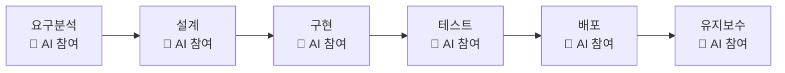
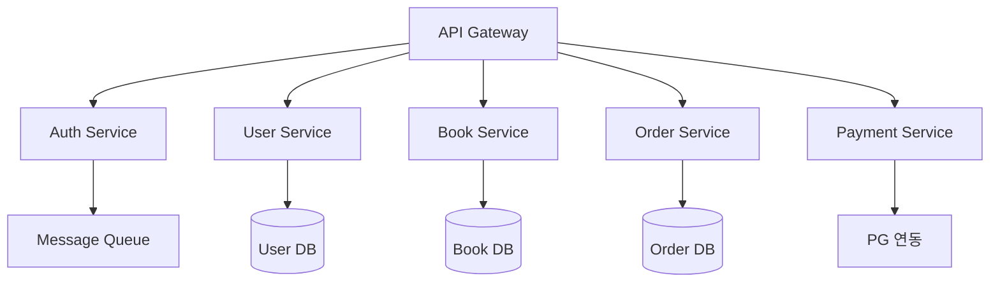
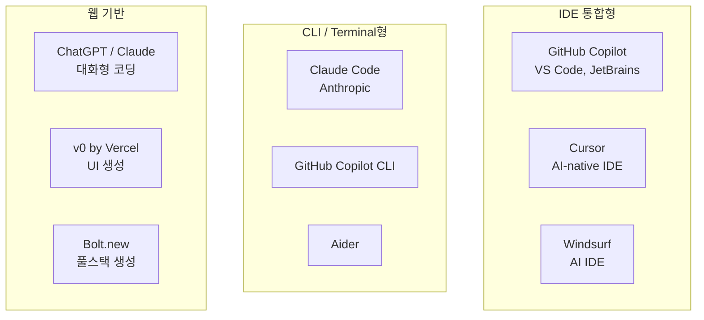
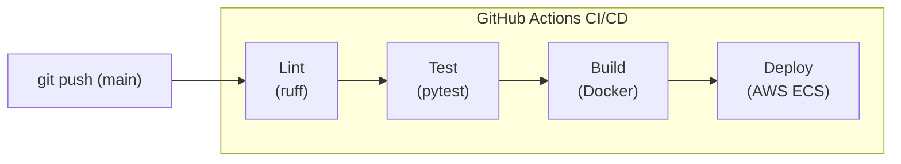
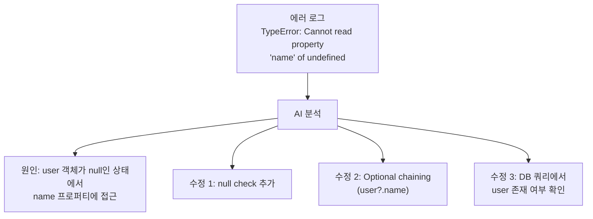
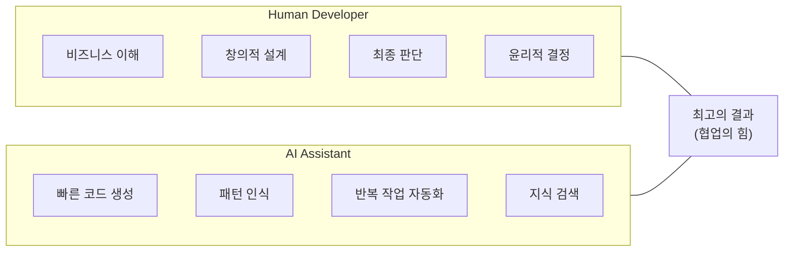

# 005. AI-Assisted SDLC

---

## AI가 SDLC를 어떻게 변화시키는가?

> 모든 SDLC 단계에 AI가 **공동 작업자(Co-pilot)**로 참여



---

## 단계별 AI 활용

### 1. 요구사항 분석 (Requirements)

| AI 활용            | 설명                            | 도구 예시       |
| ------------------ | ------------------------------- | --------------- |
| 요구사항 정리      | 자연어 대화에서 요구사항 추출   | ChatGPT, Claude |
| 사용자 스토리 생성 | 요구사항을 사용자 스토리로 변환 | AI + Jira       |
| 갭 분석            | 누락된 요구사항 식별            | AI 분석         |
| 기술 문서 초안     | PRD/SRS 자동 작성               | AI 문서 생성    |

```
예시 프롬프트:
"다음 미팅 노트에서 기능 요구사항과 비기능 요구사항을
분리하고, 사용자 스토리 형태로 정리해줘"

AI 결과:

  기능 요구사항:
    US-001: 사용자로서 로그인을 하고 싶다
    US-002: 관리자로서 사용자를 관리하고 싶다

  비기능 요구사항:
    NFR-001: 응답 시간 200ms 이내
    NFR-002: 동시 사용자 1,000명 지원
```

---

### 2. 설계 (Design)

| AI 활용         | 설명                        | 도구 예시        |
| --------------- | --------------------------- | ---------------- |
| 아키텍처 제안   | 요구사항 기반 아키텍처 추천 | Claude, GPT      |
| ERD 설계        | 데이터 모델 자동 설계       | AI + DB 도구     |
| API 설계        | OpenAPI 스펙 자동 생성      | AI 코드 생성     |
| 다이어그램 생성 | Mermaid/PlantUML 코드 생성  | AI + 시각화 도구 |



---

### 3. 구현 (Implementation)

> AI 코딩 도구의 **가장 활발한 영역**

| AI 활용   | 설명                     | 도구 예시               |
| --------- | ------------------------ | ----------------------- |
| 코드 생성 | 자연어 → 코드 변환       | Copilot, Cursor, Claude |
| 코드 완성 | 컨텍스트 기반 자동완성   | Copilot, Codeium        |
| 코드 리뷰 | 자동 코드 리뷰           | AI PR Review            |
| 리팩토링  | 코드 개선 제안           | AI + IDE                |
| 문서화    | 코드 주석/문서 자동 생성 | AI Docs                 |

### 주요 AI 코딩 도구



### AI 코딩의 효과 (GitHub 조사 결과, 2024)

| 항목          | 효과         |
| ------------- | ------------ |
| 코딩 속도     | **55% 향상** |
| 개발자 만족도 | **75% 향상** |
| 코드 품질     | 보통~향상    |
| 학습 효과     | 높음         |

---

### 4. 테스트 (Testing)

| AI 활용            | 설명                       | 도구 예시       |
| ------------------ | -------------------------- | --------------- |
| 테스트 케이스 생성 | 코드 분석 기반 자동 생성   | AI + pytest     |
| 테스트 코드 작성   | 단위/통합 테스트 자동 작성 | Copilot, Claude |
| 버그 예측          | 잠재 버그 위치 예측        | AI 정적 분석    |
| 테스트 데이터 생성 | 다양한 엣지 케이스 데이터  | AI 데이터 생성  |

```
예시: AI가 생성한 테스트 케이스

입력 코드:
  def divide(a, b):
      return a / b

AI 생성 테스트:
  ✓ test_divide_positive_numbers
  ✓ test_divide_negative_numbers
  ✓ test_divide_by_zero (예외 처리)
  ✓ test_divide_float_numbers
  ✓ test_divide_large_numbers
  ✓ test_divide_zero_by_number
```

---

### 5. 배포 (Deployment)

| AI 활용     | 설명                        | 도구 예시           |
| ----------- | --------------------------- | ------------------- |
| CI/CD 설정  | 파이프라인 자동 생성        | AI + GitHub Actions |
| IaC 생성    | Terraform/K8s 설정 생성     | AI + IaC 도구       |
| 배포 최적화 | 리소스 설정 최적화          | AI 분석             |
| 롤백 판단   | 배포 이상 감지 시 자동 판단 | AI 모니터링         |



---

### 6. 유지보수 (Maintenance)

| AI 활용     | 설명                  | 도구 예시       |
| ----------- | --------------------- | --------------- |
| 버그 분석   | 에러 로그 자동 분석   | AI + Sentry     |
| 코드 설명   | 레거시 코드 이해 지원 | AI 코드 분석    |
| 의존성 관리 | 보안 취약점 탐지      | AI + Dependabot |
| 성능 분석   | 병목 지점 식별        | AI + APM 도구   |



---

## AI-Assisted SDLC의 한계와 주의점

### 주의해야 할 점

- AI 생성 코드는 반드시 검토 필요
- 보안 취약점이 포함될 수 있음
- 비즈니스 로직의 정확성은 사람이 판단
- 라이선스/저작권 이슈 확인 필요
- AI에 과도한 의존은 기술 역량 저하 위험

### AI는 도구이지 대체제가 아니다



---

## 정리

| 단계         | AI 핵심 활용     | 효과           |
| ------------ | ---------------- | -------------- |
| **요구분석** | 자동 정리/분류   | 시간 절약      |
| **설계**     | 아키텍처 제안    | 의사결정 지원  |
| **구현**     | 코드 생성/완성   | 생산성 향상    |
| **테스트**   | 테스트 자동 생성 | 커버리지 향상  |
| **배포**     | CI/CD 자동화     | 안정성 향상    |
| **유지보수** | 버그 분석/수정   | 대응 속도 향상 |

**다음 장**: Agentic SDLC - AI Agent가 주도하는 개발 →
