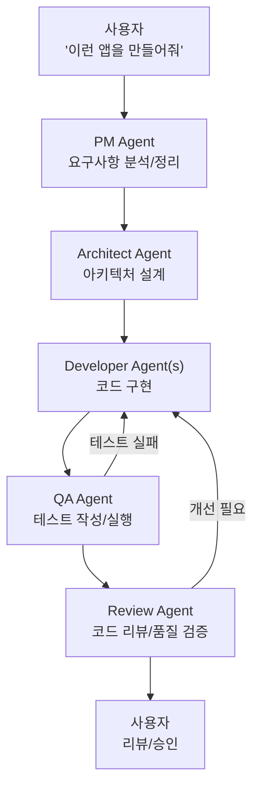
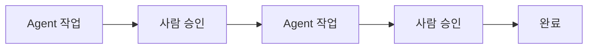
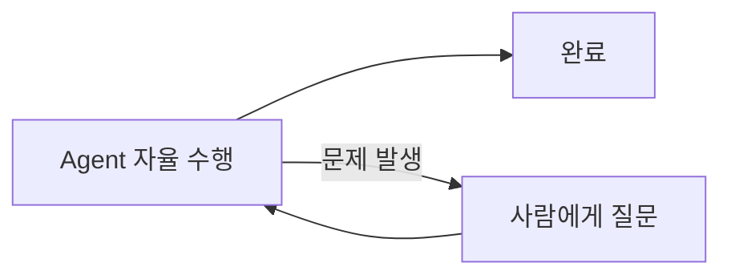
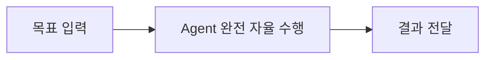
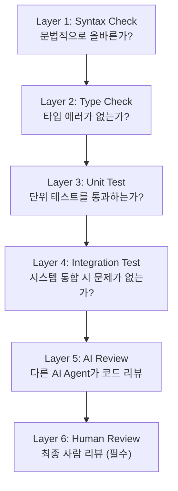
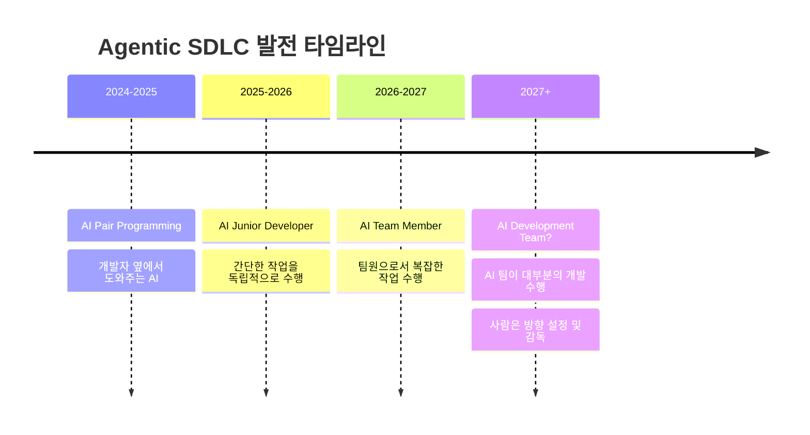

# 006. Agentic SDLC - AI Agent가 주도하는 개발

---

## AI-Assisted vs Agentic SDLC

> **AI-Assisted**: 사람이 주도, AI가 보조
> **Agentic SDLC**: AI Agent가 자율적으로 SDLC 단계를 수행

### 비교

```
AI-Assisted SDLC:
  사람: "이 함수에 대한 테스트 코드 작성해줘"
  AI:   "여기 테스트 코드입니다" (1회 응답)
  사람:  (직접 실행, 수정, 반복)

Agentic SDLC:
  사람: "이 프로젝트의 테스트 커버리지를 80%로 올려줘"
  Agent: 1. 현재 커버리지 측정 (65%)
         2. 커버리지 낮은 모듈 식별
         3. 테스트 코드 작성
         4. 테스트 실행 → 실패 시 수정
         5. 커버리지 재측정 (78%)
         6. 추가 테스트 작성
         7. 최종 확인 (82%) ✓
```

| 구분          | AI-Assisted       | Agentic                    |
| ------------- | ----------------- | -------------------------- |
| **주도권**    | 사람              | AI Agent                   |
| **상호작용**  | 매 단계 사람 개입 | 목표만 제시하면 자율 수행  |
| **복잡도**    | 단일 작업         | 다단계 복합 작업           |
| **도구 사용** | 제한적            | 적극적 (파일, 터미널, API) |
| **반복**      | 사람이 반복       | Agent가 자동 반복          |

---

## Agentic SDLC의 전체 흐름



---

## 현실의 Agentic SDLC 도구

### 1. Claude Code (Anthropic)

| 항목          | 내용                                         |
| ------------- | -------------------------------------------- |
| **형태**      | 터미널 기반 AI 에이전트                      |
| **파일 조작** | 읽기/쓰기/수정 가능                          |
| **명령 실행** | 터미널 명령어 실행 가능                      |
| **Git 연동**  | 커밋, PR 생성                                |
| **MCP**       | MCP 서버 연동                                |
| **Agentic**   | 코드베이스 탐색 → 이해 → 수정, 자율적 디버깅 |

### 2. Cursor / Windsurf

| 항목           | 내용                                        |
| -------------- | ------------------------------------------- |
| **형태**       | AI-native IDE                               |
| **Composer**   | 멀티파일 에이전트                           |
| **인덱싱**     | 코드베이스 인덱싱 & 이해                    |
| **Agent Mode** | 파일 생성/수정, 터미널 실행, 에러 자동 수정 |

### 3. Devin (Cognition)

| 항목     | 내용                                                 |
| -------- | ---------------------------------------------------- |
| **형태** | "AI Software Engineer"                               |
| **환경** | 독립적인 개발 환경 보유                              |
| **도구** | 브라우저, 터미널, 에디터 자율 사용                   |
| **협업** | PR 기반 코드 제출, Slack 연동                        |
| **SDLC** | 이슈 분석 → 코드 작성 → 테스트 → PR 생성 → 리뷰 반영 |

### 4. SWE-Agent / OpenHands

| 항목     | 내용                                    |
| -------- | --------------------------------------- |
| **형태** | 오픈소스 소프트웨어 엔지니어링 에이전트 |
| **기능** | GitHub Issue → 자동 해결                |
| **성능** | SWE-Bench 벤치마크 상위 성능            |

---

## Agentic SDLC 아키텍처 패턴

### Pattern A: Human-in-the-Loop

> 핵심 결정 지점에서 사람이 승인



**적합**: 프로덕션 코드, 중요 시스템

### Pattern B: Agent-in-the-Loop

> Agent가 자율적으로 수행, 문제 시에만 사람 개입



**적합**: 반복적 작업, 테스트 작성, 코드 마이그레이션

### Pattern C: Fully Autonomous

> Agent가 처음부터 끝까지 자율 수행



**적합**: 프로토타이핑, 보일러플레이트, PoC
**주의**: 결과 품질 검증 필수

---

## Agentic SDLC에서의 품질 보장

### AI Agent의 품질 검증 레이어



### 자동화된 품질 게이트

```
PR 생성 시 자동 실행:

  ✓ Lint check passed
  ✓ Type check passed
  ✓ Unit tests passed (42/42)
  ✓ Coverage: 85% (> 80% threshold)
  ✓ Security scan: No vulnerabilities
  ✓ AI Code Review: Approved
  ─────────────────────────────
  ⏳ Human Review: Pending
```

---

## Agentic SDLC의 현재와 미래

### 현재 (2025-2026)

| 영역               | 수준                         |
| ------------------ | ---------------------------- |
| 코드 생성/수정     | ✓ 실용 수준                  |
| 테스트 작성        | ✓ 실용 수준                  |
| 버그 수정          | ✓ 간단한 버그 자율 해결 가능 |
| 아키텍처 설계      | △ 보조 수준                  |
| 요구분석           | △ 정리/정형화 수준           |
| 복잡한 시스템 설계 | ✗ 아직 사람 필요             |
| 비즈니스 결정      | ✗ 사람 영역                  |

### 미래 전망



---

## 정리

| 핵심 개념             | 설명                                 |
| --------------------- | ------------------------------------ |
| **Agentic SDLC**      | AI Agent가 자율적으로 개발 단계 수행 |
| **Human-in-the-Loop** | 핵심 결정은 사람이 판단              |
| **품질 보장**         | 다층 자동화 검증 + 사람 리뷰         |
| **현재 수준**         | 코딩/테스트는 실용, 설계/결정은 보조 |
| **핵심 도구**         | Claude Code, Cursor, Devin 등        |

**다음 장**: 주요 Agentic 프레임워크 →
