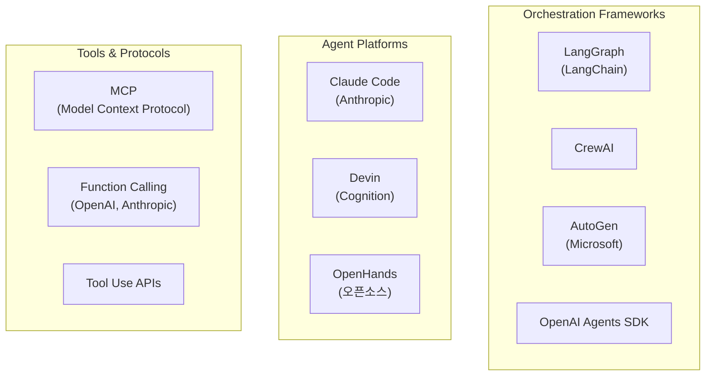
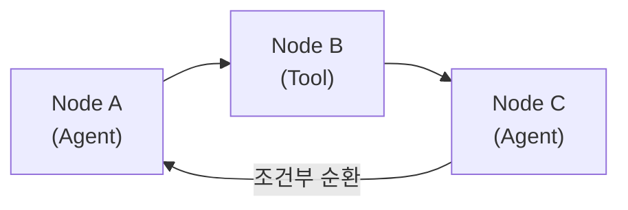
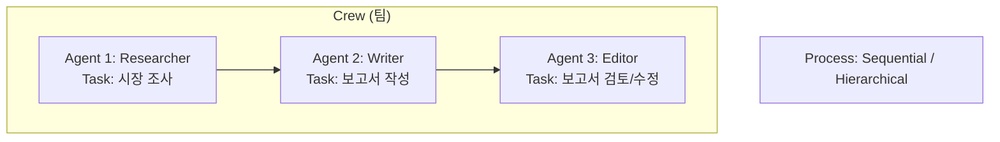
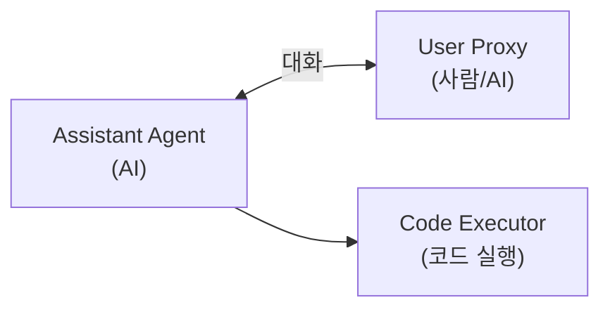
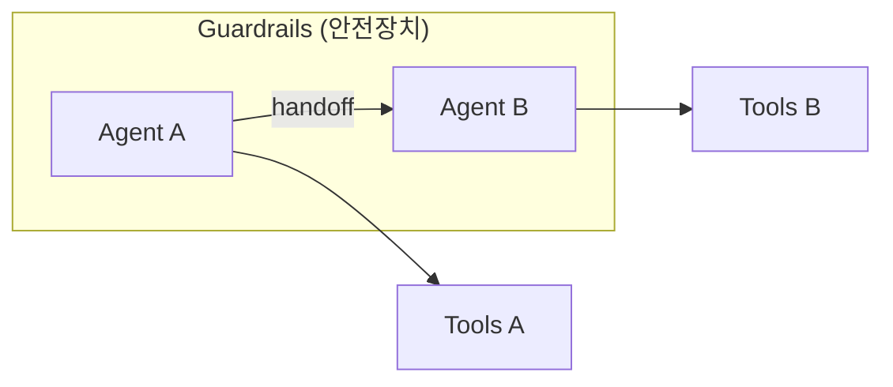
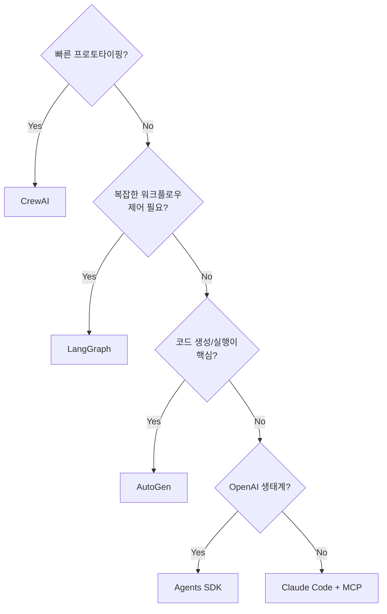

# 007. 주요 Agentic 프레임워크

---

## 프레임워크 전체 지도



---

## 1. LangGraph

> LangChain 팀이 만든 **그래프 기반 에이전트 오케스트레이션** 프레임워크

### 핵심 개념



> LangGraph = LLM + Graph (상태 머신)

### 특징

| 특징                  | 설명                                |
| --------------------- | ----------------------------------- |
| **그래프 구조**       | 노드와 엣지로 워크플로우 정의       |
| **상태 관리**         | 공유 상태(State)를 통한 데이터 전달 |
| **조건부 분기**       | 조건에 따라 다른 경로 실행          |
| **순환 지원**         | 루프(반복)가 가능한 그래프          |
| **체크포인트**        | 상태 저장 및 복원                   |
| **Human-in-the-Loop** | 사람 승인 노드 삽입 가능            |

### 코드 구조 예시

```python
from langgraph.graph import StateGraph

# 상태 정의
class AgentState(TypedDict):
    messages: list
    next_step: str

# 그래프 생성
graph = StateGraph(AgentState)

# 노드 추가
graph.add_node("planner", planner_agent)
graph.add_node("coder", coder_agent)
graph.add_node("reviewer", reviewer_agent)

# 엣지 (흐름) 정의
graph.add_edge("planner", "coder")
graph.add_conditional_edges(
    "reviewer",
    should_continue,  # 조건 함수
    {"approve": END, "revise": "coder"}
)
```

### 적합한 경우

- 복잡한 조건부 워크플로우
- 상태 관리가 중요한 에이전트
- 디버깅과 모니터링이 필요한 프로덕션 환경

---

## 2. CrewAI

> **역할 기반 멀티에이전트** 프레임워크

### 핵심 개념



### 특징

| 특징                | 설명                             |
| ------------------- | -------------------------------- |
| **역할(Role) 기반** | 각 Agent에 역할, 목표, 배경 부여 |
| **작업(Task) 할당** | 명시적 작업 정의 및 할당         |
| **프로세스 유형**   | Sequential, Hierarchical         |
| **도구 연결**       | 각 Agent에 다른 도구 할당 가능   |
| **위임**            | Agent 간 작업 위임 가능          |

### 코드 구조 예시

```python
from crewai import Agent, Task, Crew

# Agent 정의
researcher = Agent(
    role="Senior Researcher",
    goal="최신 AI 트렌드 조사",
    backstory="10년 경력의 AI 연구원",
    tools=[search_tool, web_tool]
)

writer = Agent(
    role="Tech Writer",
    goal="조사 내용을 명확한 보고서로 작성",
    backstory="기술 블로그 전문 작가"
)

# Task 정의
research_task = Task(
    description="2026년 AI Agent 트렌드 조사",
    agent=researcher
)

write_task = Task(
    description="조사 결과를 보고서로 작성",
    agent=writer
)

# Crew 구성 및 실행
crew = Crew(
    agents=[researcher, writer],
    tasks=[research_task, write_task],
    process=Process.sequential
)
result = crew.kickoff()
```

### 적합한 경우

- 역할이 명확한 팀 시뮬레이션
- 빠른 프로토타이핑
- 직관적인 멀티에이전트 구성

---

## 3. AutoGen (Microsoft)

> **대화 기반 멀티에이전트** 프레임워크

### 핵심 개념



### 특징

| 특징            | 설명                               |
| --------------- | ---------------------------------- |
| **대화 중심**   | Agent 간 메시지 교환으로 작업 수행 |
| **코드 실행**   | 생성된 코드를 자동으로 실행        |
| **유연한 구성** | 2개~N개 Agent 자유 구성            |
| **GroupChat**   | 여러 Agent가 참여하는 그룹 대화    |
| **Human Proxy** | 사람 역할을 대리하는 Agent         |

### 적합한 경우

- 코드 생성 및 실행이 핵심인 작업
- Agent 간 자유로운 대화가 필요한 경우
- 연구/실험 목적

---

## 4. OpenAI Agents SDK

> OpenAI의 공식 **경량 에이전트 프레임워크**

### 핵심 개념



### 특징

| 특징           | 설명                    |
| -------------- | ----------------------- |
| **Handoffs**   | Agent 간 작업 인계      |
| **Guardrails** | 입출력 검증 및 안전장치 |
| **Tracing**    | 실행 과정 추적/디버깅   |
| **경량**       | 최소한의 추상화         |

### 적합한 경우

- OpenAI 모델 기반 에이전트
- 간단한 멀티에이전트 시스템
- 프로덕션 배포

---

## 프레임워크 비교

### 종합 비교표

| 기준          | LangGraph       | CrewAI    | AutoGen   | Agents SDK   |
| ------------- | --------------- | --------- | --------- | ------------ |
| **패러다임**  | 그래프/상태머신 | 역할 기반 | 대화 기반 | Handoff 기반 |
| **학습 곡선** | 높음            | 낮음      | 중간      | 낮음         |
| **유연성**    | 매우 높음       | 중간      | 높음      | 중간         |
| **프로덕션**  | 적합            | 제한적    | 제한적    | 적합         |
| **LLM 지원**  | 다양            | 다양      | 다양      | OpenAI 중심  |
| **디버깅**    | 우수            | 보통      | 보통      | 우수         |
| **커뮤니티**  | 대형            | 성장 중   | 대형      | 성장 중      |

### 선택 가이드



---

## 프레임워크 없이 구축하기

### Anthropic의 권장: "가능하면 프레임워크 없이"

> 프레임워크가 항상 필요한 것은 아님.
> 간단한 에이전트는 **LLM API + 도구 호출 루프**로 충분.

```python
# 프레임워크 없는 기본 Agent 루프
import anthropic

client = anthropic.Anthropic()
tools = [...]  # 도구 정의

messages = [{"role": "user", "content": task}]

while True:
    response = client.messages.create(
        model="claude-sonnet-4-5-20250929",
        tools=tools,
        messages=messages
    )

    # 도구 호출이 있으면 실행
    if response.stop_reason == "tool_use":
        tool_result = execute_tool(response.content)
        messages.append({"role": "assistant", "content": response.content})
        messages.append({"role": "user", "content": tool_result})
    else:
        # 완료
        break
```

### 프레임워크 도입 기준

| 프레임워크가 필요한 경우   | 프레임워크가 불필요한 경우      |
| -------------------------- | ------------------------------- |
| 복잡한 멀티에이전트 시스템 | 단일 에이전트, 간단한 도구 호출 |
| 상태 관리/체크포인트 중요  | 프로토타이핑 단계               |
| 프로덕션급 모니터링/디버깅 | 커스텀 제어가 중요한 경우       |
| 팀 단위 개발               |                                 |

---

## 정리

| 프레임워크     | 핵심 키워드          | 추천 상황                |
| -------------- | -------------------- | ------------------------ |
| **LangGraph**  | 그래프, 상태, 유연성 | 복잡한 프로덕션 에이전트 |
| **CrewAI**     | 역할, 팀, 직관적     | 빠른 프로토타이핑        |
| **AutoGen**    | 대화, 코드 실행      | 코드 중심 에이전트       |
| **Agents SDK** | 경량, Handoff        | OpenAI 기반 프로덕션     |
| **직접 구현**  | 제어, 단순함         | 간단한 에이전트          |

**다음 장**: 실습 가이드 →
