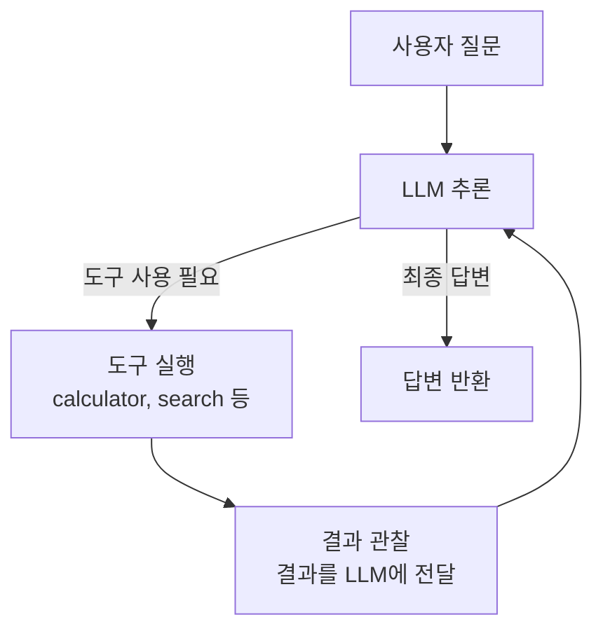
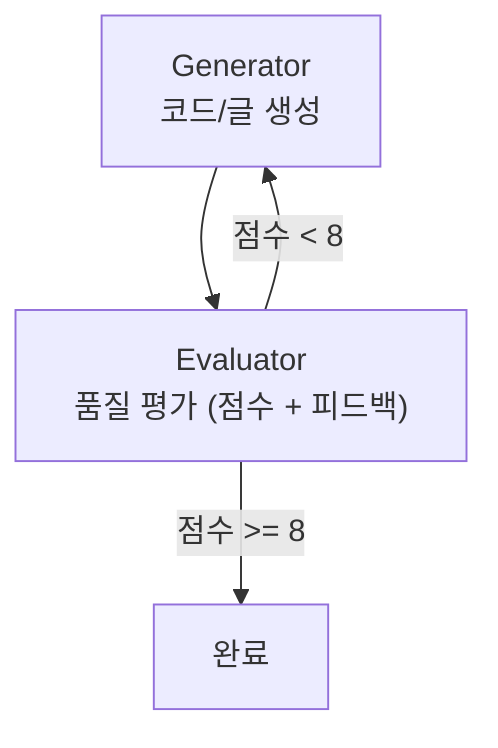
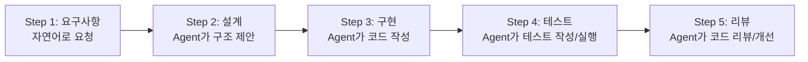
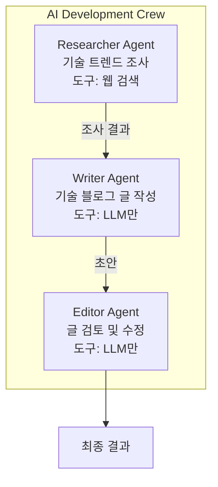

# 008. 실습 가이드

---

## 실습 개요

> 이론에서 배운 Agentic Workflow와 SDLC 개념을 직접 체험

### 실습 목표

1. Agentic 패턴이 실제로 어떻게 동작하는지 이해
2. AI Agent가 SDLC에 어떻게 참여하는지 체험
3. Agent를 직접 구축하는 기본 방법 습득
4. 프레임워크 활용 방법 학습

---

## 실습 1: 기본 Agent 루프 구현

> ReAct 패턴으로 간단한 Agent 만들기

### 목표

- LLM API + Tool 호출 루프를 직접 구현
- Plan → Act → Observe 순환을 체험

### 구현할 Agent 흐름



### 핵심 코드 구조

```python
# 실습 1: 기본 ReAct Agent

import anthropic

client = anthropic.Anthropic()

# 도구 정의
tools = [
    {
        "name": "calculator",
        "description": "수학 계산을 수행합니다",
        "input_schema": {
            "type": "object",
            "properties": {
                "expression": {
                    "type": "string",
                    "description": "계산할 수학 표현식"
                }
            },
            "required": ["expression"]
        }
    },
    {
        "name": "get_weather",
        "description": "도시의 현재 날씨를 조회합니다",
        "input_schema": {
            "type": "object",
            "properties": {
                "city": {
                    "type": "string",
                    "description": "도시명"
                }
            },
            "required": ["city"]
        }
    }
]

# 도구 실행 함수
def execute_tool(name, input_data):
    if name == "calculator":
        return str(eval(input_data["expression"]))
    elif name == "get_weather":
        # Mock 데이터
        return f"{input_data['city']}: 맑음, 5°C"

# Agent 루프
def run_agent(user_message):
    messages = [{"role": "user", "content": user_message}]

    while True:
        response = client.messages.create(
            model="claude-sonnet-4-5-20250929",
            max_tokens=1024,
            tools=tools,
            messages=messages
        )

        # 응답을 메시지에 추가
        messages.append({
            "role": "assistant",
            "content": response.content
        })

        # 도구 호출이 있는지 확인
        tool_calls = [
            block for block in response.content
            if block.type == "tool_use"
        ]

        if not tool_calls:
            # 최종 답변
            final = [
                block.text for block in response.content
                if block.type == "text"
            ]
            return "\n".join(final)

        # 도구 실행 결과를 메시지에 추가
        tool_results = []
        for tool_call in tool_calls:
            result = execute_tool(
                tool_call.name,
                tool_call.input
            )
            tool_results.append({
                "type": "tool_result",
                "tool_use_id": tool_call.id,
                "content": result
            })

        messages.append({
            "role": "user",
            "content": tool_results
        })

# 실행
answer = run_agent(
    "서울 날씨를 알려주고, 기온에 10을 곱하면 얼마인지 계산해줘"
)
print(answer)
```

### 실습 포인트

- `while True` 루프가 Agent의 **반복적 동작**을 구현
- `stop_reason`이 `tool_use`이면 도구 실행 후 계속
- 도구 결과를 다시 LLM에 전달하는 것이 핵심

---

## 실습 2: Reflection 패턴 구현

> 자기 평가와 개선을 반복하는 Agent

### 목표

- Generator + Evaluator 구조 체험
- 반복적 품질 개선 과정 이해

### 구현할 흐름



### 핵심 코드 구조

```python
# 실습 2: Reflection Agent

def generate(task, feedback=None):
    prompt = f"다음 작업을 수행해주세요: {task}"
    if feedback:
        prompt += f"\n\n이전 피드백을 반영해주세요:\n{feedback}"

    response = client.messages.create(
        model="claude-sonnet-4-5-20250929",
        max_tokens=2048,
        messages=[{"role": "user", "content": prompt}]
    )
    return response.content[0].text

def evaluate(task, result):
    prompt = f"""다음 작업 결과를 평가해주세요.

작업: {task}
결과:
{result}

JSON으로 응답해주세요:
{{"score": 1-10, "feedback": "개선 사항"}}"""

    response = client.messages.create(
        model="claude-sonnet-4-5-20250929",
        max_tokens=1024,
        messages=[{"role": "user", "content": prompt}]
    )
    return json.loads(response.content[0].text)

def reflection_agent(task, max_iterations=3, threshold=8):
    result = generate(task)

    for i in range(max_iterations):
        evaluation = evaluate(task, result)
        print(f"반복 {i+1}: 점수 {evaluation['score']}/10")

        if evaluation["score"] >= threshold:
            print("품질 기준 충족!")
            return result

        result = generate(task, evaluation["feedback"])

    return result
```

---

## 실습 3: Claude Code로 Agentic SDLC 체험

> 실제 AI Agent 도구로 SDLC 단계를 수행

### 실습 시나리오



### Claude Code 사용 예시

```bash
# Claude Code 실행
$ claude

# 1. 요구사항 전달
> FastAPI로 TODO CRUD API를 만들어줘.
  SQLite를 사용하고 테스트도 작성해줘.

# Agent가 자율적으로:
# - 프로젝트 구조 설계
# - 코드 작성 (models, routes, schemas)
# - 테스트 작성
# - 실행 및 검증
# - 필요시 수정
```

### 관찰 포인트

- Agent가 어떤 순서로 작업하는가?
- 어떤 도구를 사용하는가?
- 에러 발생 시 어떻게 대응하는가?
- 코드 품질은 어떠한가?
- 사람의 개입이 필요한 순간은?

---

## 실습 4: Multi-Agent 시스템 (CrewAI)

> 역할 기반 멀티에이전트 팀 구성

### 목표

- CrewAI로 3인 에이전트 팀 구성
- 역할 분담과 협업 과정 체험

### 팀 구성



### 핵심 코드

```python
from crewai import Agent, Task, Crew, Process

researcher = Agent(
    role="Tech Researcher",
    goal="최신 Agentic AI 트렌드 조사",
    backstory="AI 분야 5년 경력 리서처"
)

writer = Agent(
    role="Tech Writer",
    goal="조사 내용을 명확한 블로그 글로 작성",
    backstory="기술 블로그 전문 작가"
)

editor = Agent(
    role="Editor",
    goal="글의 품질과 정확성을 검토",
    backstory="기술 콘텐츠 에디터"
)

# Task 정의
research = Task(
    description="2026년 AI Agent 트렌드를 조사하라",
    expected_output="주요 트렌드 5가지와 각 설명",
    agent=researcher
)

write = Task(
    description="조사 결과를 블로그 글로 작성하라",
    expected_output="1000자 내외의 블로그 포스트",
    agent=writer
)

edit = Task(
    description="블로그 글을 검토하고 개선하라",
    expected_output="최종 블로그 포스트",
    agent=editor
)

crew = Crew(
    agents=[researcher, writer, editor],
    tasks=[research, write, edit],
    process=Process.sequential
)

result = crew.kickoff()
```

---

## 실습 환경 설정

### 필요한 패키지

```bash
# 기본 패키지
pip install anthropic openai

# 프레임워크 (선택)
pip install crewai
pip install langgraph langchain-anthropic

# 실습 도구
pip install fastapi uvicorn pytest httpx
```

### 환경 변수

```bash
# .env 파일
ANTHROPIC_API_KEY=your-api-key-here
OPENAI_API_KEY=your-api-key-here  # (선택)
```

---

## 실습 체크리스트

### 실습 1: 기본 Agent 루프

- [ ] Tool 정의 및 등록
- [ ] Agent 루프 구현 (Plan-Act-Observe)
- [ ] 멀티턴 대화 동작 확인
- [ ] 다양한 질문으로 테스트

### 실습 2: Reflection 패턴

- [ ] Generator 구현
- [ ] Evaluator 구현
- [ ] 반복 개선 루프 동작 확인
- [ ] 반복 횟수에 따른 품질 변화 관찰

### 실습 3: Agentic SDLC (Claude Code)

- [ ] Claude Code로 프로젝트 생성
- [ ] Agent의 SDLC 단계별 행동 관찰
- [ ] 결과물 품질 평가

### 실습 4: Multi-Agent (CrewAI)

- [ ] 역할별 Agent 구성
- [ ] Task 정의 및 연결
- [ ] 팀 실행 및 결과 확인
- [ ] Agent 간 협업 과정 관찰

---

## 정리

| 실습       | 패턴             | 핵심 학습            |
| ---------- | ---------------- | -------------------- |
| **실습 1** | ReAct / Tool Use | Agent 기본 루프 이해 |
| **실습 2** | Reflection       | 자기 개선 패턴 이해  |
| **실습 3** | Agentic SDLC     | 실무 AI Agent 체험   |
| **실습 4** | Multi-Agent      | 팀 협업 패턴 이해    |
