# 01. Agentic Workflow & Design Patterns

---

## Agentic Workflow란?

> LLM이 **자율적으로 판단하고, 도구를 사용하며, 반복적으로 문제를 해결**하는 워크플로우

### 기존 LLM 사용 방식 vs Agentic Workflow

| 구분      | 기존 방식 (Single-turn) | Agentic Workflow                 |
| --------- | ----------------------- | -------------------------------- |
| 흐름      | 질문 → 답변 (1회)       | 질문 → 계획 → 실행 → 관찰 → 반복 |
| 도구 사용 | 없음                    | 외부 도구/API 호출               |
| 자율성    | 수동적 응답             | 능동적 판단과 행동               |
| 복잡도    | 단순 질의응답           | 다단계 복합 작업                 |
| 결과물    | 텍스트 응답             | 실제 작업 수행 결과              |

---

## 왜 Agentic Workflow인가?

### LLM의 한계와 Agentic의 해결

| LLM의 한계 | Agentic의 해결 |
| --- | --- |
| **지식의 한계**: 학습 데이터 이후 정보 부재 | **도구 사용**: 검색, API 호출로 극복 |
| **실행 능력 부재**: 텍스트 생성만 가능 | **코드 실행**: 실제 행동 수행 |
| **단일 턴의 제약**: 복잡한 문제 한 번에 해결 어려움 | **반복적 개선**: 결과를 관찰하고 개선하는 루프 |
| **환각(Hallucination)**: 사실이 아닌 정보 생성 | **자기 검증**: 도구로 결과를 검증하고 수정 |

### Andrew Ng의 핵심 메시지

> *"AI agentic workflows will drive massive AI progress this year"* — Andrew Ng, 2024

1. **Zero-shot vs Agentic**: GPT-3.5를 Agentic으로 쓰면 GPT-4 Zero-shot보다 성능이 좋을 수 있다
2. **반복(Iteration)이 핵심**: 한 번에 완벽한 답을 기대하지 말고, 반복적으로 개선
3. **사람의 작업 방식과 유사**: 초안 → 검토 → 수정 → 완성

---

## 핵심 구성 요소

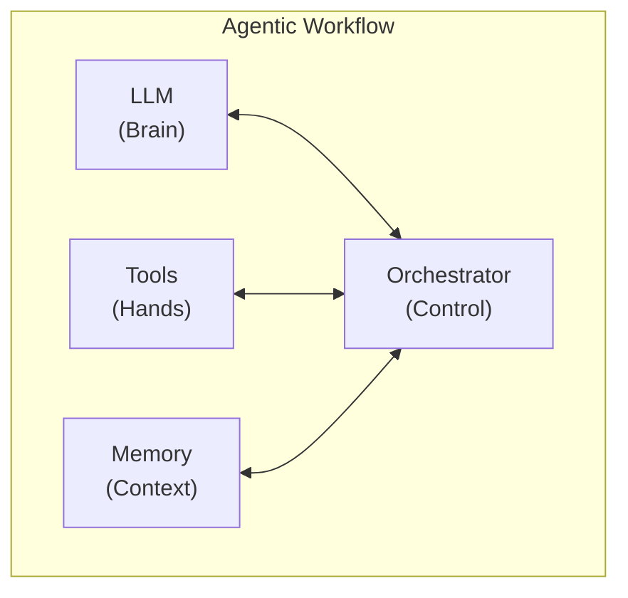

| 구성 요소 | 역할 | 예시 |
| --- | --- | --- |
| **LLM (Brain)** | 자연어 이해, 추론, 계획 수립 | Claude, GPT |
| **Tools (Hands)** | 외부 도구/API 호출 | 웹 검색, 코드 실행, 파일 조작 |
| **Memory (Context)** | 단기/장기/작업 기억 | 대화 컨텍스트, 벡터 DB |
| **Orchestrator (Control)** | 전체 흐름 관리, 에러 핸들링 | 루프, 분기, 종료 조건 |

---

## 기본 루프: Plan → Act → Observe

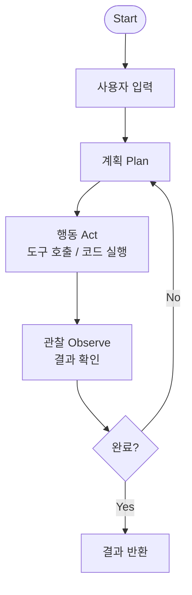

### 예시: "서울 날씨에 맞는 옷을 추천해줘"

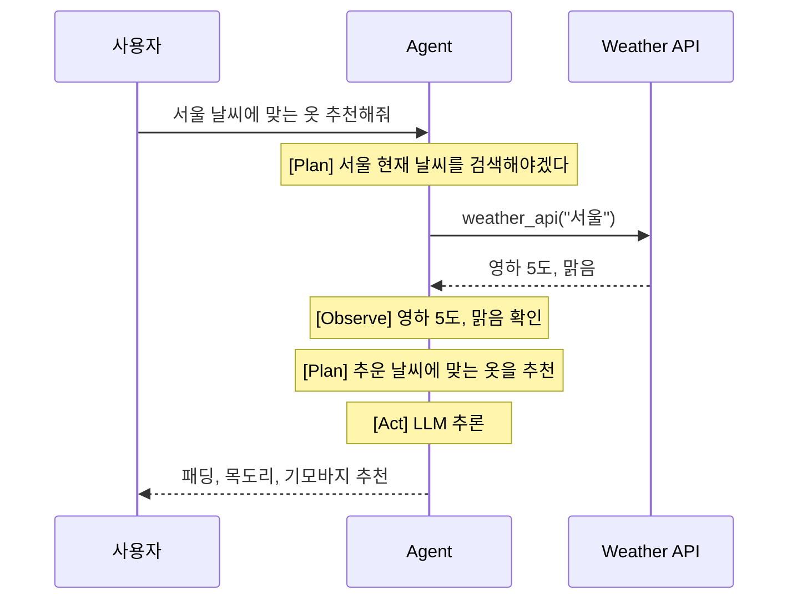

---

## 4가지 Agentic Design Patterns

Andrew Ng이 제안한 4가지 핵심 패턴:

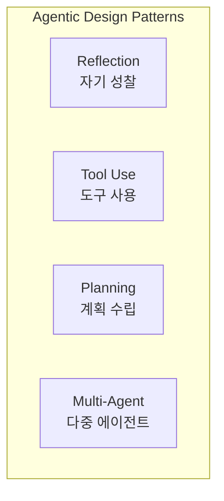

---

## Pattern 1: Reflection (자기 성찰)

> LLM이 자신의 출력을 **스스로 평가하고 개선**하는 패턴

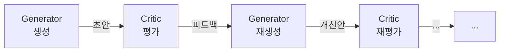

### 동작 방식

1. **생성(Generate)**: 초기 답변/코드 생성
2. **평가(Critique)**: 결과물을 비판적으로 검토
3. **개선(Refine)**: 피드백을 반영하여 개선
4. **반복**: 품질 기준 충족 시까지 반복

### Reflection의 변형

| 변형            | 설명                      | 예시                     |
| --------------- | ------------------------- | ------------------------ |
| **Self-Refine** | 단일 LLM이 생성+평가      | 코드 생성 후 자체 리뷰   |
| **Reflexion**   | 실행 결과를 관찰하여 반영 | 테스트 실패 시 코드 수정 |
| **CRITIC**      | 도구로 검증 후 개선       | 계산기로 수학 답 검증    |

---

## Pattern 2: Tool Use (도구 사용)

> LLM이 **외부 도구를 호출하여 능력을 확장**하는 패턴

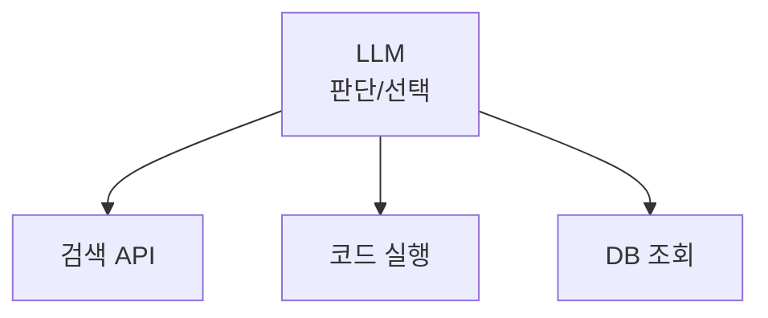

### 주요 도구 유형

| 도구 유형        | 예시                 | 역할              |
| ---------------- | -------------------- | ----------------- |
| **정보 검색**    | Web Search, RAG      | 최신 정보 획득    |
| **코드 실행**    | Python REPL, Sandbox | 계산, 데이터 처리 |
| **파일 조작**    | Read/Write/Edit      | 파일 생성 및 수정 |
| **외부 API**     | REST API, GraphQL    | 서비스 연동       |
| **데이터베이스** | SQL, Vector DB       | 데이터 조회/저장  |

### MCP (Model Context Protocol)

- Anthropic이 제안한 도구 연결 표준 프로토콜
- 다양한 도구를 **통일된 인터페이스**로 LLM에 연결
- 이전 스터디(Advanced-01)에서 학습한 내용 참고

---

## Pattern 3: Planning (계획 수립)

> LLM이 복잡한 작업을 **단계별로 분해하고 순서를 정하는** 패턴

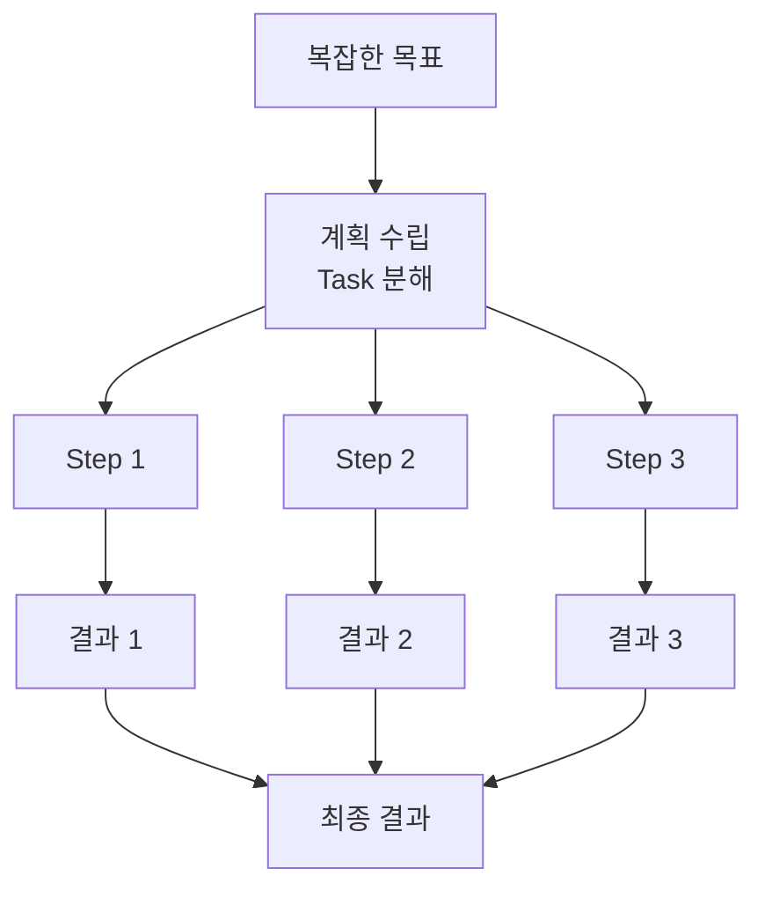

### ReAct (Reasoning + Acting)

가장 대표적인 Agentic 패턴:

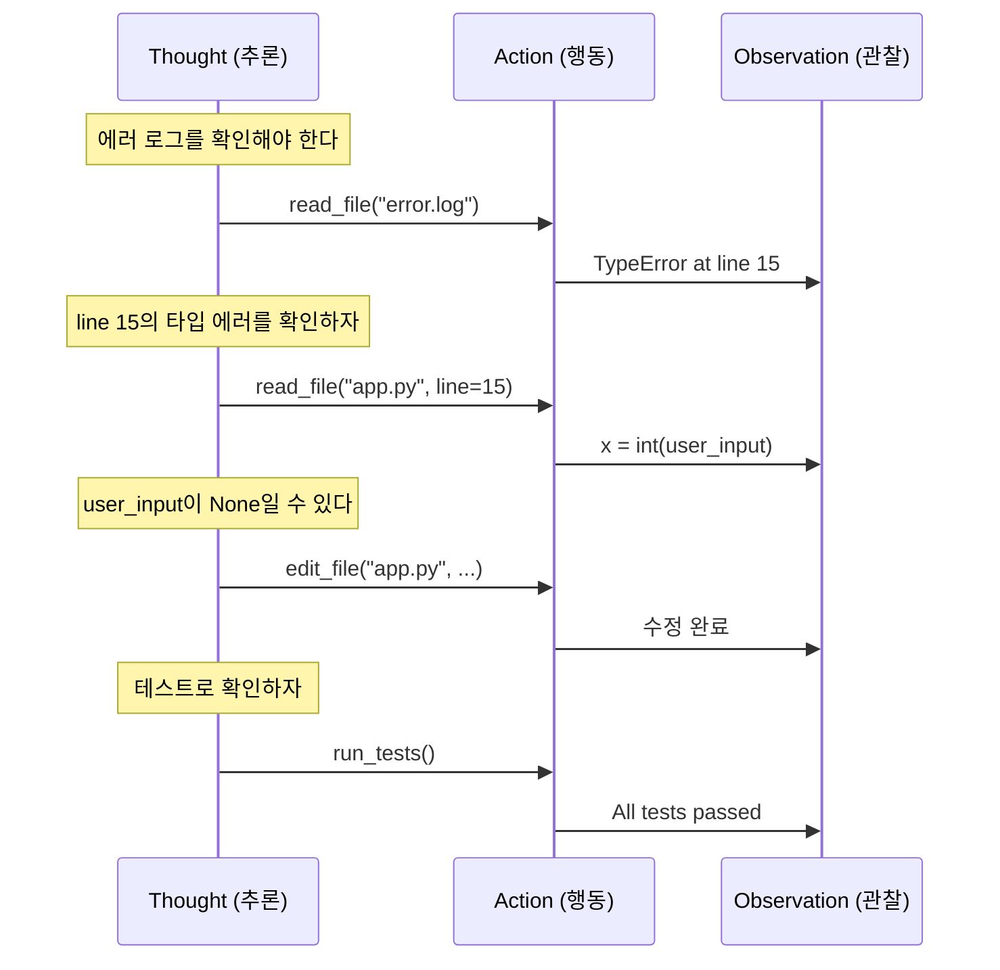

---

## Pattern 4: Multi-Agent (다중 에이전트)

> 여러 에이전트가 **역할을 나누어 협업**하는 패턴

### 구조 유형

#### A. 수평적 협업 (Peer Collaboration)

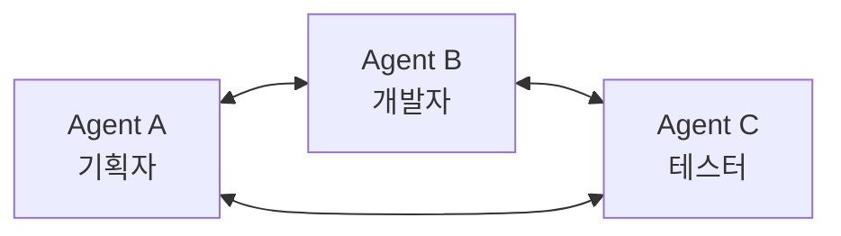

#### B. 계층적 관리 (Hierarchical)

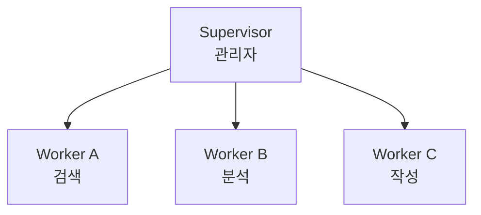

#### C. 파이프라인 (Sequential Pipeline)

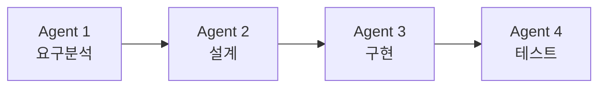

---

## 패턴 조합

실제 프로젝트에서는 이 패턴들을 **조합**하여 사용:

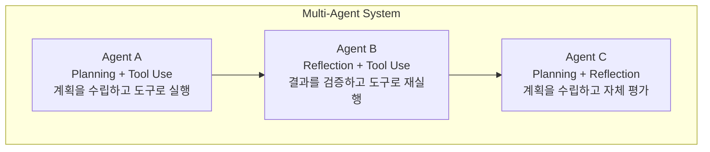

---

## 실사례: Genspark AI - 4가지 패턴의 조합

> Genspark은 2025년 AI 검색 엔진에서 **Agentic AI Workspace**로 전환,
> 4가지 패턴을 모두 조합하여 **L4 자율 에이전트**를 구현한 대표 사례

### Genspark의 아키텍처

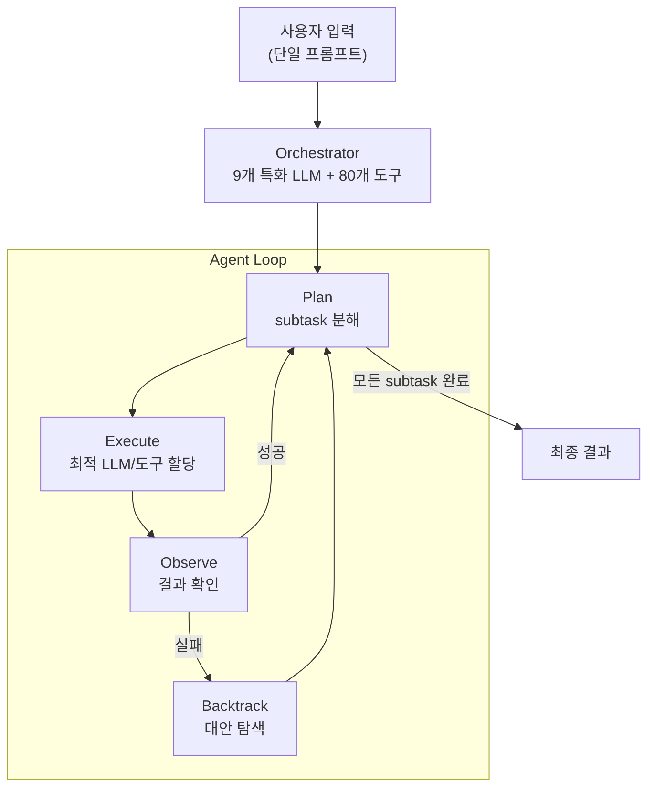

### 4가지 패턴이 어떻게 적용되는가?

| 패턴 | Genspark 적용 방식 |
|------|-------------------|
| **Planning** | 사용자 입력을 자동으로 subtask로 분해 |
| **Tool Use** | 80개 이상 도구 통합 (전화, 슬라이드, 영상, 검색 등) |
| **Routing** (Multi-Agent) | 9개의 특화 LLM 중 작업에 최적인 모델로 자동 라우팅 |
| **Reflection** | **Backtrack 단계** - 실패 시 대안 접근법을 탐색하여 재시도 |

### 핵심 철학: "Less Control, More Tools"

```
기존 방식:     사전 정의된 워크플로우 (rigid)
               → 엣지 케이스에서 깨짐

Genspark 방식: 사전 정의 없이 Agent가 자율적으로 경로 결정
               → 실패해도 Backtrack으로 복구
```

> *"Power actually lives in the backtrack stage."*
> — 실패 시 지능적으로 복구하고 대안을 찾는 것이 핵심

### 성과

- 출시 45일 만에 ARR $36M 달성
- Series B $275M 투자 유치 (기업가치 $1.25B)

---

## 정리

| 패턴            | 핵심 아이디어      | 효과        |
| --------------- | ------------------ | ----------- |
| **Reflection**  | 자기 평가와 개선   | 품질 향상   |
| **Tool Use**    | 외부 도구 활용     | 능력 확장   |
| **Planning**    | 작업 분해와 순서화 | 복잡도 관리 |
| **Multi-Agent** | 역할 분담과 협업   | 확장성      |

> 실사례 Genspark은 이 4가지 패턴을 **모두 조합**하여 L4 자율 에이전트를 구현

**다음 장**: Agent 아키텍처 심화 →
