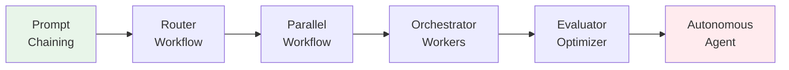
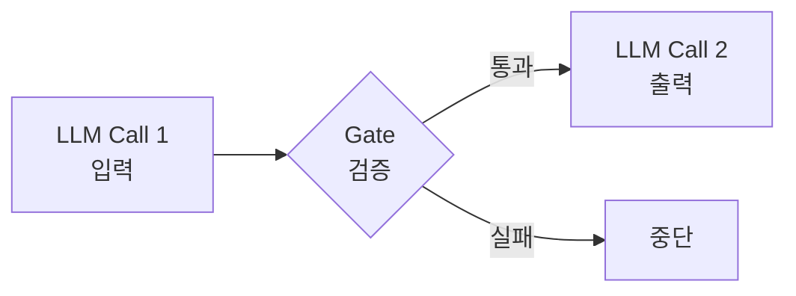
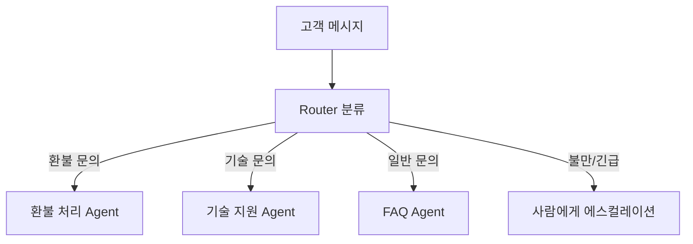
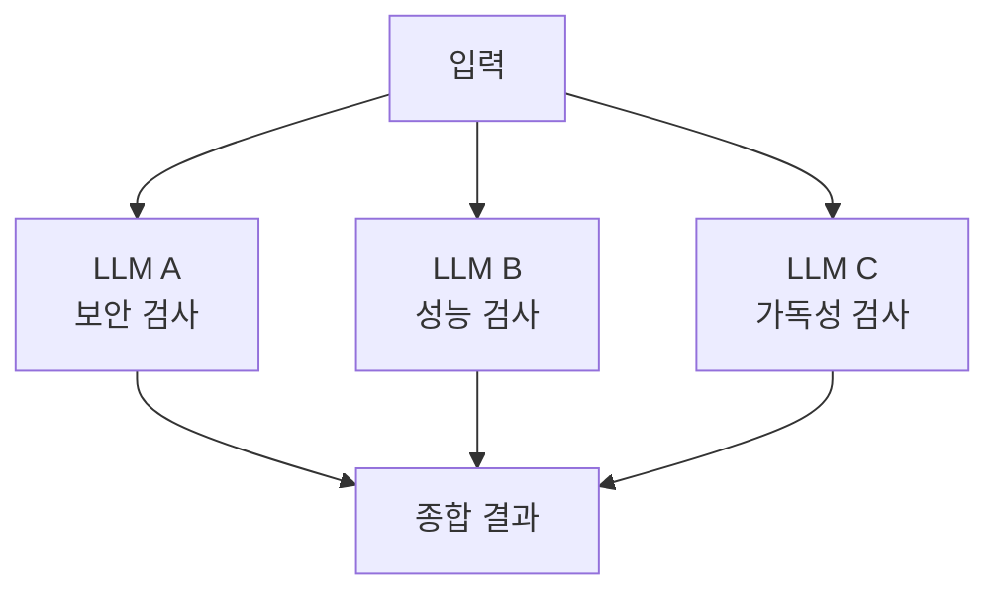
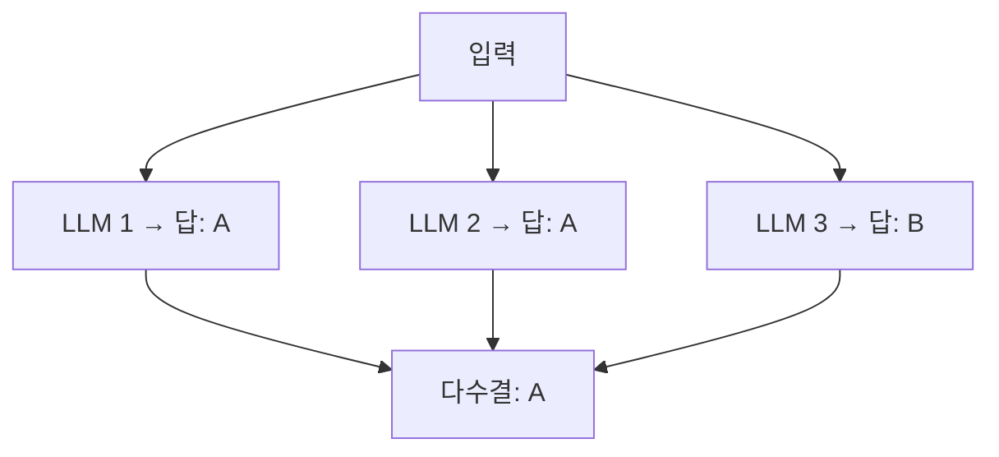
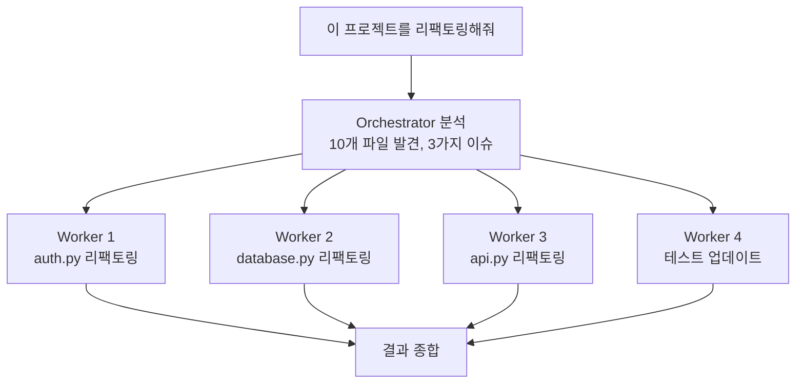
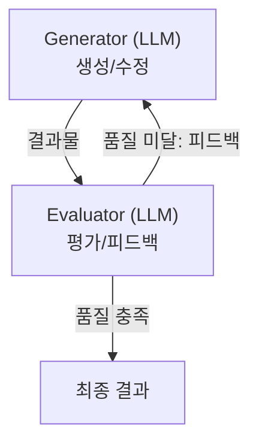
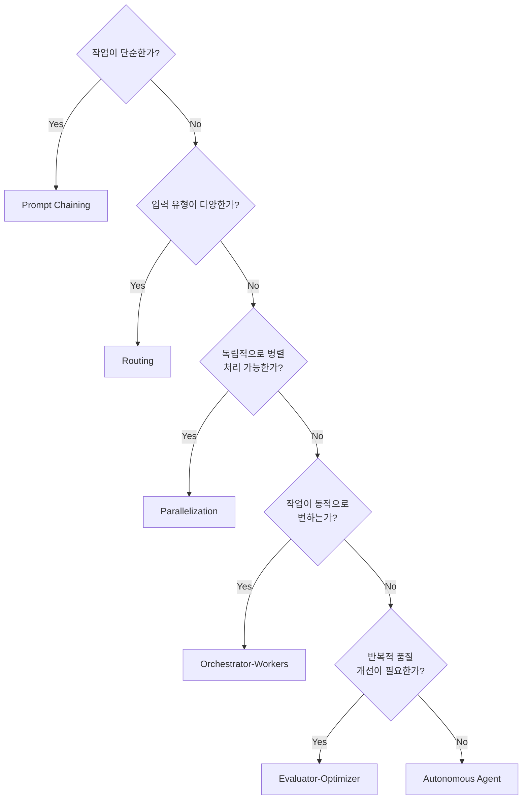

# 02. Agent 아키텍처 심화

---

## Agent 아키텍처 스펙트럼

Anthropic의 "Building Effective Agents" 가이드 기반:

> **간단함** ←――――――――――――――――→ **복잡함**

> **핵심 원칙**: 가능한 한 가장 단순한 구조를 사용하라.
> 복잡한 아키텍처는 필요할 때만 도입한다.

---

## Level 1: Prompt Chaining (프롬프트 체이닝)

> LLM 호출을 **순차적으로 연결**, 이전 출력이 다음 입력이 됨

- 각 단계가 **명확하고 독립적**, 중간에 게이트(검증) 추가 가능
- **사용 사례**: 마케팅 카피 생성 (특징 분석 → 키워드 추출 → 카피 생성 → 선택)

---

## Level 2: Routing Workflow (라우팅)

> 입력을 **분류하여 적절한 처리 경로로 분기**

- 각 경로에 **전문화된 프롬프트/모델** 사용 가능
- 간단한 요청은 가벼운 모델, 복잡한 요청은 강력한 모델 → **비용 최적화**

---

## Level 3: Parallelization (병렬화)

> 여러 LLM 호출을 **동시에 실행**하여 효율성 증대

### A. Sectioning (분할)

### B. Voting (투표)

- **사용 사례**: 코드 리뷰(보안/성능/스타일 병렬 검사), 콘텐츠 검수, 의사결정

---

## Level 4: Orchestrator-Workers (오케스트레이터-워커)

> 중앙 오케스트레이터가 **동적으로 작업을 분배**하고 결과를 종합

### Prompt Chaining과의 차이

| 구분   | Prompt Chaining | Orchestrator-Workers |
| ------ | --------------- | -------------------- |
| 단계   | 사전에 고정     | **동적으로 결정**    |
| 분기   | 없음 (순차)     | 입력에 따라 변화     |
| 병렬   | 불가            | 가능                 |
| 유연성 | 낮음            | **높음**             |

---

## Level 5: Evaluator-Optimizer (평가자-최적화)

> 생성과 평가를 **분리**하여 반복적으로 품질 향상

- Reflection 패턴의 **구체적 아키텍처 구현**
- Generator와 Evaluator를 **다른 프롬프트/모델**로 분리
- **사용 사례**: 번역 품질 개선 (번역 → 평가 85/100 → 재번역 → 95/100 통과)

---

## 아키텍처 선택 가이드

---

## 정리

| 아키텍처                 | 핵심         | 적합한 경우            |
| ------------------------ | ------------ | ---------------------- |
| **Prompt Chaining**      | 순차 연결    | 단계가 명확한 작업     |
| **Routing**              | 분류 후 분기 | 입력 유형이 다양       |
| **Parallelization**      | 동시 실행    | 독립적 하위 작업       |
| **Orchestrator-Workers** | 동적 분배    | 복잡하고 유동적인 작업 |
| **Evaluator-Optimizer**  | 반복 개선    | 높은 품질 요구         |

**다음 장**: SDLC와 AI →
