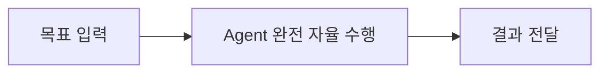

# 03. SDLC와 AI

---

## SDLC란?

> **SDLC (Software Development Life Cycle)**
> 소프트웨어를 계획, 개발, 테스트, 배포, 유지보수하는 **전체 생명주기 프로세스**


| 단계              | 활동                    | 산출물                |
| ----------------- | ----------------------- | --------------------- |
| **요구사항 분석** | 무엇을 만들 것인가 정의 | 요구사항 명세서 (SRS) |
| **설계**          | 어떻게 만들 것인가 설계 | 아키텍처/설계 문서    |
| **구현**          | 실제 코드 작성          | 소스 코드             |
| **테스트**        | 품질 검증               | 테스트 결과 보고서    |
| **배포**          | 사용자에게 전달         | 릴리스, 배포 환경     |
| **유지보수**      | 버그 수정, 기능 개선    | 패치, 업데이트        |

---

## 전통적 SDLC 모델 비교

| 기준            | Waterfall        | Agile           | DevOps         |
| --------------- | ---------------- | --------------- | -------------- |
| **접근 방식**   | 순차적           | 반복적          | 지속적         |
| **변경 대응**   | 어려움           | 유연            | 매우 유연      |
| **피드백 주기** | 프로젝트 종료 시 | 스프린트(2-4주) | 실시간         |
| **팀 구조**     | 단계별 분리      | 크로스펑셔널    | Dev + Ops 통합 |
| **문서화**      | 매우 상세        | 최소한          | 코드 = 문서    |
| **릴리스**      | 한 번            | 스프린트마다    | 지속적         |

### Waterfall → Agile → DevOps 발전


---

## AI-Assisted SDLC

> 모든 SDLC 단계에 AI가 **공동 작업자(Co-pilot)**로 참여

### 단계별 AI 활용

| 단계         | AI 핵심 활용            | 도구 예시               | 효과           |
| ------------ | ----------------------- | ----------------------- | -------------- |
| **요구분석** | 요구사항 자동 정리/분류 | ChatGPT, Claude         | 시간 절약      |
| **설계**     | 아키텍처 제안, ERD 설계 | Claude, GPT             | 의사결정 지원  |
| **구현**     | 코드 생성/완성/리뷰     | Copilot, Cursor, Claude | 생산성 향상    |
| **테스트**   | 테스트 케이스 자동 생성 | AI + pytest             | 커버리지 향상  |
| **배포**     | CI/CD 설정, IaC 생성    | AI + GitHub Actions     | 안정성 향상    |
| **유지보수** | 버그 분석, 코드 설명    | AI + Sentry             | 대응 속도 향상 |

### AI 코딩의 효과 (GitHub 조사 결과, 2024)

| 항목          | 효과         |
| ------------- | ------------ |
| 코딩 속도     | **55% 향상** |
| 개발자 만족도 | **75% 향상** |
| 코드 품질     | 보통~향상    |
| 학습 효과     | 높음         |

### AI-Assisted의 한계

- AI 생성 코드는 반드시 검토 필요
- 보안 취약점이 포함될 수 있음
- 비즈니스 로직의 정확성은 사람이 판단
- AI에 과도한 의존은 기술 역량 저하 위험

---

## Agentic SDLC

> **AI-Assisted**: 사람이 주도, AI가 보조
> **Agentic SDLC**: AI Agent가 자율적으로 SDLC 단계를 수행

### AI-Assisted vs Agentic 비교

```
AI-Assisted SDLC:
  사람: "이 함수에 대한 테스트 코드 작성해줘"
  AI:   "여기 테스트 코드입니다" (1회 응답)
  사람:  (직접 실행, 수정, 반복)

Agentic SDLC:
  사람: "이 프로젝트의 테스트 커버리지를 80%로 올려줘"
  Agent: 1. 현재 커버리지 측정 (65%)
         2. 커버리지 낮은 모듈 식별
         3. 테스트 코드 작성
         4. 테스트 실행 → 실패 시 수정
         5. 커버리지 재측정 (78%)
         6. 추가 테스트 작성
         7. 최종 확인 (82%) ✓
```

| 구분          | AI-Assisted       | Agentic                    |
| ------------- | ----------------- | -------------------------- |
| **주도권**    | 사람              | AI Agent                   |
| **상호작용**  | 매 단계 사람 개입 | 목표만 제시하면 자율 수행  |
| **복잡도**    | 단일 작업         | 다단계 복합 작업           |
| **도구 사용** | 제한적            | 적극적 (파일, 터미널, API) |
| **반복**      | 사람이 반복       | Agent가 자동 반복          |

---

## Agentic SDLC의 전체 흐름


---

## 현실의 Agentic SDLC 도구

| 도구 | 형태 | 핵심 기능 |
| --- | --- | --- |
| **Claude Code** (Anthropic) | 터미널 기반 AI Agent | 코드베이스 탐색/수정, Git 연동, MCP, 자율적 디버깅 |
| **Cursor / Windsurf** | AI-native IDE | 멀티파일 에이전트, 코드베이스 인덱싱, 에러 자동 수정 |
| **Devin** (Cognition) | AI Software Engineer | 독립 개발 환경, 이슈→코드→테스트→PR 자율 수행 |
| **SWE-Agent / OpenHands** | 오픈소스 SWE Agent | GitHub Issue 자동 해결, SWE-Bench 상위 성능 |

---

## Agentic SDLC 아키텍처 패턴

### Pattern A: Human-in-the-Loop

> 핵심 결정 지점에서 사람이 승인


**적합**: 프로덕션 코드, 중요 시스템

### Pattern B: Agent-in-the-Loop

> Agent가 자율적으로 수행, 문제 시에만 사람 개입


**적합**: 반복적 작업, 테스트 작성, 코드 마이그레이션

### Pattern C: Fully Autonomous

> Agent가 처음부터 끝까지 자율 수행



**적합**: 프로토타이핑, 보일러플레이트, PoC
**주의**: 결과 품질 검증 필수

---

## 품질 보장: 다층 검증 레이어


---

## Agentic SDLC의 현재 수준 (2025-2026)

| 영역               | 수준                         |
| ------------------ | ---------------------------- |
| 코드 생성/수정     | ✓ 실용 수준                  |
| 테스트 작성        | ✓ 실용 수준                  |
| 버그 수정          | ✓ 간단한 버그 자율 해결 가능 |
| 아키텍처 설계      | △ 보조 수준                  |
| 요구분석           | △ 정리/정형화 수준           |
| 복잡한 시스템 설계 | ✗ 아직 사람 필요             |
| 비즈니스 결정      | ✗ 사람 영역                  |

---

## 정리

| 핵심 개념             | 설명                                 |
| --------------------- | ------------------------------------ |
| **SDLC**              | 소프트웨어 개발의 전체 생명주기      |
| **AI-Assisted SDLC**  | AI가 Co-pilot으로 각 단계 보조       |
| **Agentic SDLC**      | AI Agent가 자율적으로 개발 단계 수행 |
| **Human-in-the-Loop** | 핵심 결정은 사람이 판단              |
| **품질 보장**         | 다층 자동화 검증 + 사람 리뷰         |

**다음 장**: 실습 →
