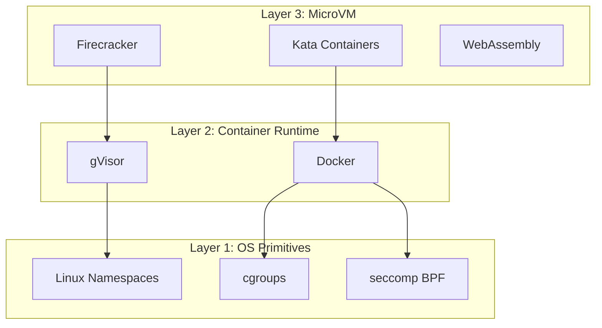
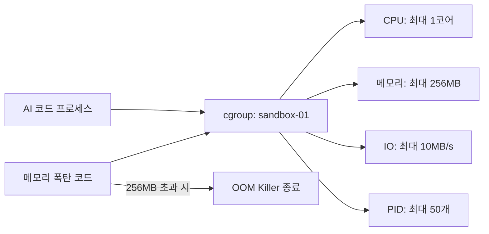
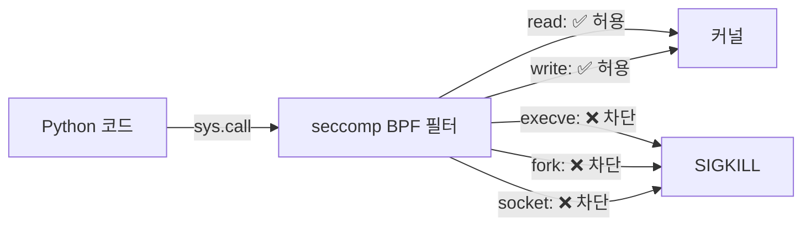
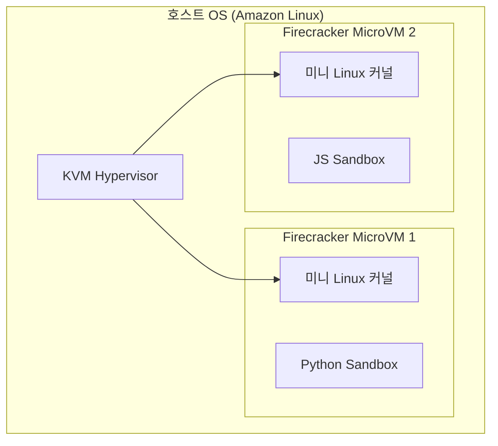
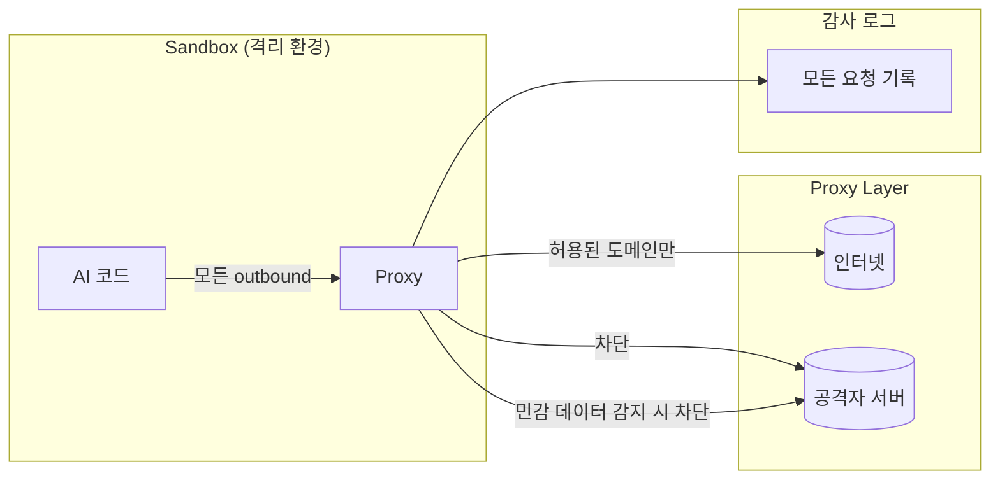

# 02. 격리 기술 스택 — Sandbox가 작동하는 원리

> 팀 질문 3: "샌드박스가 가능한 원리가 알고 싶어요"

---

## 전체 격리 기술 계층



| 기술 레이어 | 격리 강도 | 성능 오버헤드 | 주요 사용처 |
|------------|-----------|--------------|------------|
| **OS Primitives** | ★★★☆☆ | 매우 낮음 | 기본 컨테이너 |
| **Container (Docker)** | ★★★★☆ | 낮음 | CI/CD, 개발 환경 |
| **gVisor** | ★★★★★ | 중간 | OpenAI, Modal |
| **Firecracker MicroVM** | ★★★★★ | 낮음 | E2B, AWS Lambda |
| **WASM** | ★★★★☆ | 낮음 | 브라우저, Edge |

---

## Layer 1: OS 기본 격리 도구

### 1-1. Linux Namespaces — "프로세스가 보는 세계를 분리"

> Namespace = 프로세스가 **무엇을 볼 수 있는지**를 제한하는 OS 기능

```
호스트 OS
├── PID Namespace: PID 1=systemd, PID 1234=nginx, ...
│
└── Sandbox Process (새 Namespace)
    ├── PID Namespace: 이 프로세스는 PID 1=python (호스트 PID 모름!)
    ├── NET Namespace: eth0 없음, 가상 인터페이스만
    ├── MNT Namespace: /=읽기전용 rootfs (호스트 / 접근 불가)
    ├── IPC Namespace: 호스트 IPC 큐 접근 불가
    └── USER Namespace: 내부 root = 호스트의 일반 유저
```

**6가지 Namespace 종류:**

| Namespace | 격리 대상 | 효과 |
|-----------|-----------|------|
| **PID** | 프로세스 목록 | 샌드박스가 호스트 프로세스 볼 수 없음 |
| **NET** | 네트워크 인터페이스 | 독립적인 네트워크 스택 |
| **MNT** | 파일시스템 마운트 | 독립적인 파일시스템 뷰 |
| **IPC** | 메모리/세마포어 | 호스트 IPC 접근 불가 |
| **USER** | UID/GID | 내부 root ≠ 호스트 root |
| **UTS** | 호스트명 | 독립적인 hostname |

```bash
# 실제 명령: 새 네트워크 namespace에서 실행
unshare --net --pid --mount --fork bash
# → 이 bash는 호스트 네트워크/프로세스 목록을 볼 수 없음!
```

---

### 1-2. cgroups (Control Groups) — "리소스 사용량 제한"

> cgroups = 프로세스 그룹이 **얼마나 많은 리소스**를 쓸 수 있는지 제한



**주요 cgroup 서브시스템:**

| 서브시스템 | 제한 항목 | 예시 값 |
|-----------|-----------|---------|
| `cpu` | CPU 사용률 | 50% (0.5 core) |
| `memory` | 메모리 + 스왑 | 256MB |
| `blkio` | 디스크 I/O | 10MB/s |
| `pids` | 프로세스 수 | 50개 |
| `net_cls` | 네트워크 패킷 분류 | 트래픽 우선순위 |

```python
# Python에서 resource limits 설정 (cgroups 대안)
import resource

# CPU: 5초 초과 시 SIGXCPU
resource.setrlimit(resource.RLIMIT_CPU, (5, 5))

# 메모리: 256MB 초과 시 MemoryError
resource.setrlimit(resource.RLIMIT_AS, (256 * 1024 * 1024, 256 * 1024 * 1024))

# 파일 크기: 1MB 초과 시 IOError
resource.setrlimit(resource.RLIMIT_FSIZE, (1024 * 1024, 1024 * 1024))
```

---

### 1-3. seccomp BPF — "허용된 시스템 콜만 통과"

> seccomp = 프로세스가 **어떤 OS 기능을 호출**할 수 있는지 제한하는 필터



**시스템콜 허용/차단 전략:**

```
Denylist 방식 (약함):
  기본: 모두 허용
  차단: execve, fork, socket, ... (알려진 위험만)
  문제: 모르는 위험한 콜 누락 가능

Allowlist 방식 (강함, 권장):
  기본: 모두 차단
  허용: read, write, mmap, brk, ... (필요한 것만)
  장점: 알려지지 않은 공격도 차단
```

**Python 코드 실행에 필요한 최소 시스템콜 예시:**
```
read, write, close, fstat, mmap, mprotect,
munmap, brk, rt_sigaction, access, openat, exit_group
```

---

## Layer 2: 컨테이너 런타임

### 2-1. Docker — Namespace + cgroups의 편리한 조합

```
Docker Container
├── 자체 파일시스템 (Union Mount)
├── 자체 네트워크 (veth pair)
├── 자체 PID 공간
└── cgroups 리소스 제한

단점: 호스트 커널을 공유
→ 커널 취약점(CVE) 발생 시 Escape 가능
```

### 2-2. gVisor — 사용자 공간 커널 (Google 개발)

> gVisor = 커널을 **사용자 공간에서 재구현** → 호스트 커널 직접 접근 원천 차단

```
일반 컨테이너:
  App → [syscall] → 호스트 커널 (공유!)

gVisor:
  App → [syscall] → Sentry (사용자 공간 커널) → 제한된 syscall → 호스트 커널

  Sentry = Go로 작성된 Linux 커널 구현체
  → 앱은 실제 커널에 접근할 수 없음
```

**gVisor 사용 사례:**
- OpenAI Code Interpreter
- Modal (ML 워크로드)
- Google Cloud Run

---

## Layer 3: MicroVM — "진짜 VM인데 가볍게"

### 3-1. Firecracker (AWS 개발)

> Firecracker = KVM 기반 초경량 VM, **125ms 안에 부팅**

```
Firecracker MicroVM
├── 독립 Linux 커널 (호스트와 완전 분리!)
├── 최소한의 가상 디바이스 (vNIC, vBlock만)
├── 메모리: 최소 64MB
└── 부팅 시간: ~125ms

vs 일반 VM (EC2):
└── 부팅 시간: ~60초
```



**Firecracker 특징:**
| 항목 | 값 |
|------|-----|
| 부팅 시간 | ~125ms |
| 최소 메모리 | 64MB |
| 사용 사례 | E2B, AWS Lambda, Fargate |
| 격리 수준 | VM 급 (최고) |
| 네트워크 | 완전 격리 가능 |

### 3-2. WebAssembly (WASM) — 브라우저 Sandbox

```
WASM Sandbox 특징:
├── 선형 메모리 모델: 메모리 경계 위반 시 즉시 종료
├── 캡abilities 기반: 명시적으로 부여된 기능만 사용
├── 네트워크: 기본 차단 (WASI에서 명시적 허용 필요)
└── 사용 사례: Cloudflare Workers, Deno, Fastly Compute
```

---

## 네트워크 격리 심화 — 팀 질문 2

> "프록시 통제로 외부로 데이터 안나가는 것..."

### 아키텍처



### 네트워크 격리 구현 방법

**방법 1: Network Namespace (OS 레벨)**
```bash
# 새 network namespace 생성 (인터넷 접근 없음)
ip netns add sandbox-ns
ip netns exec sandbox-ns python code.py
# → 외부 네트워크 접근 시 ConnectionRefusedError
```

**방법 2: iptables (방화벽 레벨)**
```bash
# sandbox 컨테이너에서 외부 outbound 차단
iptables -A OUTPUT -m owner --uid-owner sandbox-user -j REJECT

# 특정 도메인만 허용 (화이트리스트)
iptables -A OUTPUT -m owner --uid-owner sandbox-user \
  -d api.anthropic.com -j ACCEPT
```

**방법 3: Socket Monkey-Patching (Python 레벨)**
```python
# 모든 socket 연결을 인터셉트하여 검사
import socket
_original_connect = socket.socket.connect

def safe_connect(self, address):
    host = address[0]
    ALLOWED = {'localhost', '127.0.0.1', 'api.anthropic.com'}
    if host not in ALLOWED:
        raise ConnectionRefusedError(f"🚫 차단: {host}")
    return _original_connect(self, address)

socket.socket.connect = safe_connect
```

**데이터 유출 탐지 (DLP - Data Loss Prevention):**
```python
SENSITIVE_PATTERNS = [
    r'sk-[a-zA-Z0-9]{40,}',          # API 키
    r'\b\d{4}-\d{4}-\d{4}-\d{4}\b',  # 신용카드
    r'[a-zA-Z0-9._%+-]+@[a-zA-Z0-9.-]+\.[a-zA-Z]{2,}',  # 이메일
    r'/etc/passwd',                    # 시스템 파일 경로
]
```

---

## 격리 기술 최종 비교

| 기술 | 격리 대상 | 강점 | 약점 |
|------|-----------|------|------|
| **Namespace** | 가시성 | OS 기본 제공, 오버헤드 없음 | 커널 공유 취약점 |
| **cgroups** | 리소스 | 세밀한 제어 | 실행 자체는 막지 못함 |
| **seccomp** | 시스템콜 | 커널 인터페이스 차단 | 설정 복잡 |
| **Docker** | 통합 | 편의성 | 커널 취약점 공유 |
| **gVisor** | 커널 | 커널 격리 | CPU 오버헤드 |
| **Firecracker** | 완전 VM | 최강 격리 | 메모리 오버헤드 |
| **WASM** | 메모리/기능 | 브라우저 호환 | 생태계 제한 |

---

**다음 장**: 이 기술들을 실제 프로덕션에서 어떻게 쓰는지, E2B/Modal/Claude Code의 사례 →
