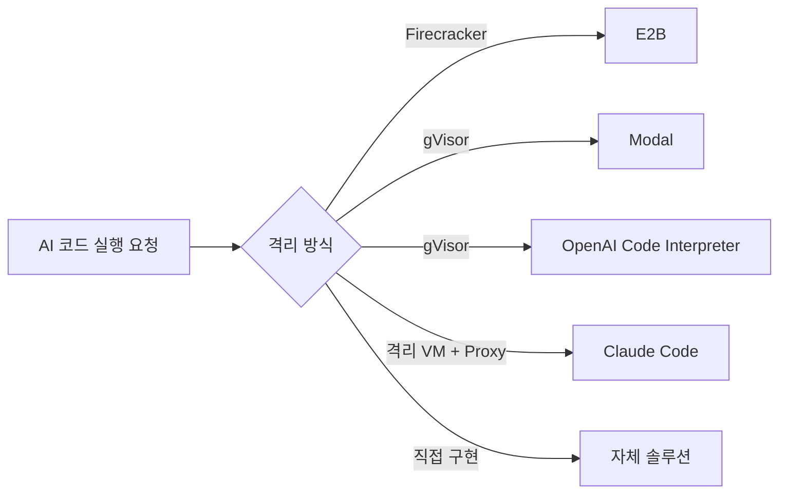
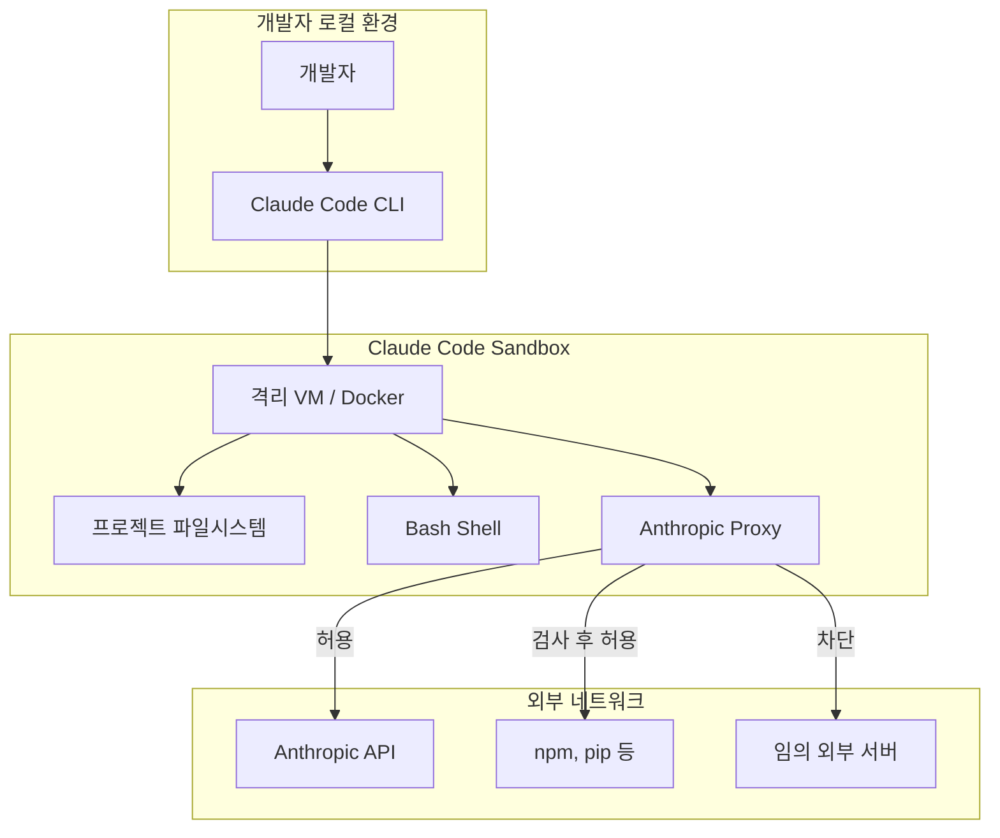
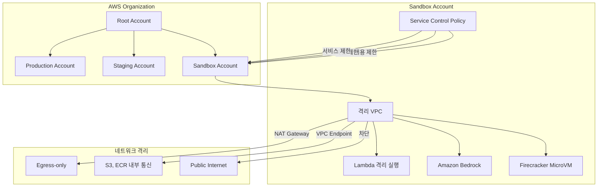
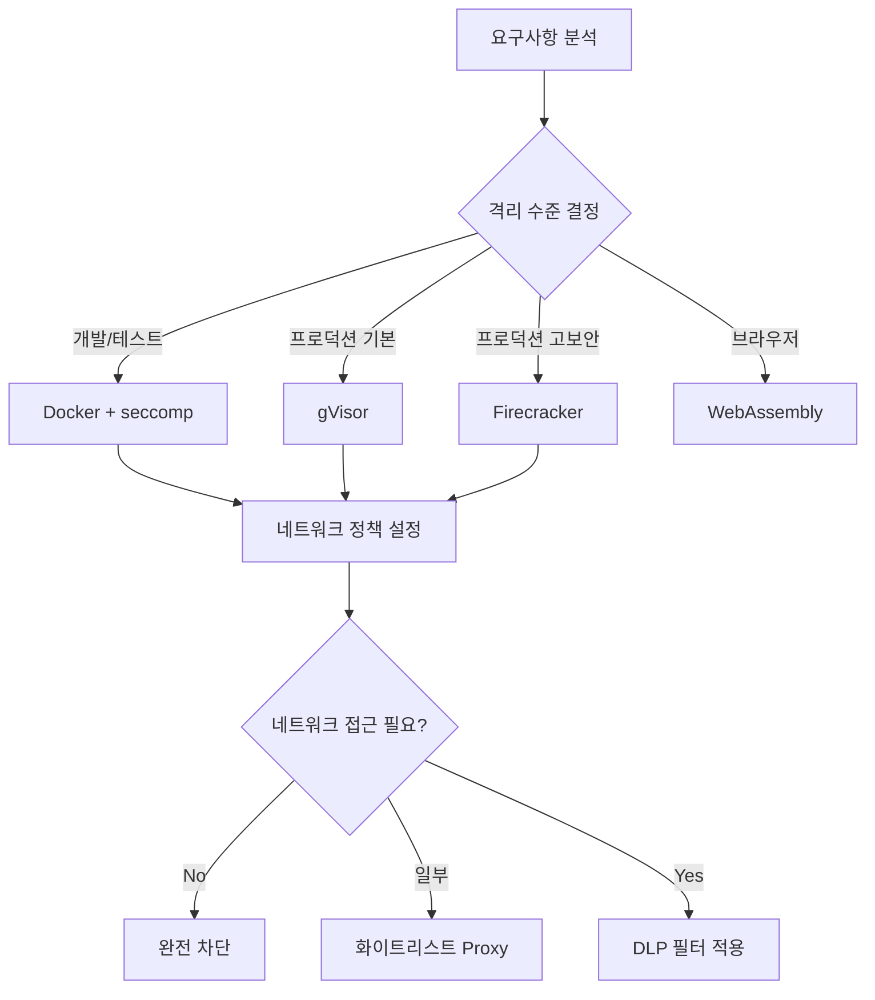

# 03. 실제 구현체 비교 — 프로덕션의 Sandbox

---

## 왜 직접 만들지 않고 쓰는가?

| 직접 구현 | 프로덕션 서비스 사용 |
|-----------|---------------------|
| 취약점 직접 책임 | 전문 보안팀이 관리 |
| 설정 복잡 (namespaces + seccomp + ...) | API 한 줄로 격리 환경 |
| 스케일링 직접 구현 | 자동 스케일링 |
| MicroVM 관리 부담 | 인프라 추상화 |

---

## 주요 구현체 비교



### 비교 표

| 서비스 | 격리 기술 | Cold Start | 네트워크 정책 | 파일시스템 | 특징 |
|--------|-----------|-----------|--------------|-----------|------|
| **E2B** | Firecracker MicroVM | ~150ms | 사용자 설정 가능 | 영구 저장 지원 | 개발자 친화적 API |
| **Modal** | gVisor | ~400ms | 기본 허용 | 임시 (ephemeral) | GPU 지원, ML 특화 |
| **OpenAI CI** | gVisor | ~1-2s | 외부 차단 | 읽기전용 + 임시 | ChatGPT 통합 |
| **Claude Code** | 격리 VM | N/A | Proxy 제어 | 프로젝트 단위 | IDE 통합 |
| **Repl.it** | 컨테이너 | ~2s | 허용 | 영구 | 교육용 |

---

## E2B (e2b.dev) — Firecracker 기반

### 아키텍처

```
E2B Sandbox 요청
    │
    ▼
E2B API ──► Firecracker MicroVM 생성 (~150ms)
                │
                ├── 독립 Linux 커널 (최소 이미지)
                ├── Python/Node.js 런타임
                ├── 가상 파일시스템 (선택적 영구화)
                └── 네트워크: 사용자 설정 (화이트리스트 가능)
```

### 사용 예시

```python
from e2b_code_interpreter import Sandbox

# 격리된 환경에서 코드 실행 (API 한 줄!)
with Sandbox() as sandbox:
    result = sandbox.run_code("""
import os
print(os.getcwd())       # /home/user (격리된 환경)
print(os.getenv('HOME')) # /home/user
# os.system('rm -rf /') 시도해도 호스트에 영향 없음!
    """)
    print(result.text)
```

**핵심 특징:**
- **150ms Cold Start**: Firecracker snapshots 활용 (메모리 스냅샷으로 빠른 복원)
- **Pause/Resume**: 샌드박스 상태를 멈추고 재개 가능
- **파일 업로드/다운로드**: 양방향 파일 전송
- **인터넷 접근**: 기본 허용 (차단 설정 가능)

---

## Modal — gVisor 기반 ML 특화

### 아키텍처

```
Modal 함수 실행
    │
    ▼
Modal Scheduler
    │
    ▼
gVisor Container (Sentry 커널)
    ├── CUDA 드라이버 패스스루 (GPU 접근)
    ├── Python 환경 (커스텀 이미지)
    └── 네트워크: 기본 허용
```

```python
import modal

app = modal.App()
image = modal.Image.debian_slim().pip_install("torch")

@app.function(gpu="A100", image=image)
def train_model():
    # 격리된 gVisor 환경에서 GPU 학습!
    import torch
    return torch.cuda.is_available()
```

**핵심 특징:**
- **GPU 지원**: gVisor + GPU 패스스루 (유일한 조합)
- **커스텀 이미지**: Docker 이미지 기반 환경 정의
- **자동 스케일링**: 0에서 N개까지 자동

---

## OpenAI Code Interpreter — 가장 엄격한 제한

### 아키텍처

```
ChatGPT "코드 분석기"
    │
    ▼
Code Interpreter Sandbox (gVisor)
    ├── Python 3.x (제한된 패키지)
    ├── 파일시스템: 읽기전용 + /tmp (임시)
    ├── 네트워크: 완전 차단 ❌
    ├── 실행 시간: 최대 120초
    └── 메모리: 제한됨
```

**차단 목록:**
- 인터넷 접근 (outbound 완전 차단)
- 시스템 명령어 (`os.system`, `subprocess`)
- `import` 불가 모듈: `socket`, `urllib`(외부), `requests`

**허용 목록:**
- numpy, pandas, matplotlib, sklearn, PIL
- 파일 업로드/다운로드 (ChatGPT UI 통해서만)
- `/tmp` 쓰기 (세션 종료 시 삭제)

---

## Anthropic Claude Code — 프록시 제어 방식

### 아키텍처 (팀 질문 2 답변)



**핵심 특징:**
- **프록시 기반 네트워크 제어**: 모든 outbound 트래픽이 Anthropic 프록시 통과
- **패키지 매니저 허용**: npm install, pip install은 허용 (패키지 저장소 접근)
- **임의 외부 서버 차단**: `curl attacker.com` 등 임의 도메인 차단
- **파일시스템**: 프로젝트 디렉토리에 쓰기 가능 (호스트 OS에 영향)
- **감사 로그**: 모든 실행 명령 기록

---

## AWS Sandbox 환경 — 엔터프라이즈 아키텍처

> 참고: https://docs.aws.amazon.com/ko_kr/prescriptive-guidance/latest/choosing-git-branch-approach/sandbox-environment.html

### AWS Sandbox 계정 전략



**AWS Sandbox 핵심 정책:**
- **완전 격리 계정**: Production과 다른 AWS 계정 → 권한 경계 명확
- **SCP(Service Control Policy)**: 특정 서비스/리전만 사용 가능
- **자동 삭제**: 30일 후 리소스 자동 정리
- **비용 알람**: 일정 금액 초과 시 자동 차단

---

## 나만의 Sandbox 구현 가이드



**최소 Sandbox 체크리스트:**
- [ ] 프로세스 격리 (PID namespace)
- [ ] 파일시스템 격리 (읽기전용 or chroot)
- [ ] 네트워크 격리 또는 프록시
- [ ] CPU/메모리 제한 (cgroups or resource limits)
- [ ] 실행 시간 제한 (timeout)
- [ ] 감사 로그 (auditd, eBPF)
- [ ] 정적 분석 (AST 검사)

---

**다음 장**: 실습 코드로 직접 체험해보기 →
